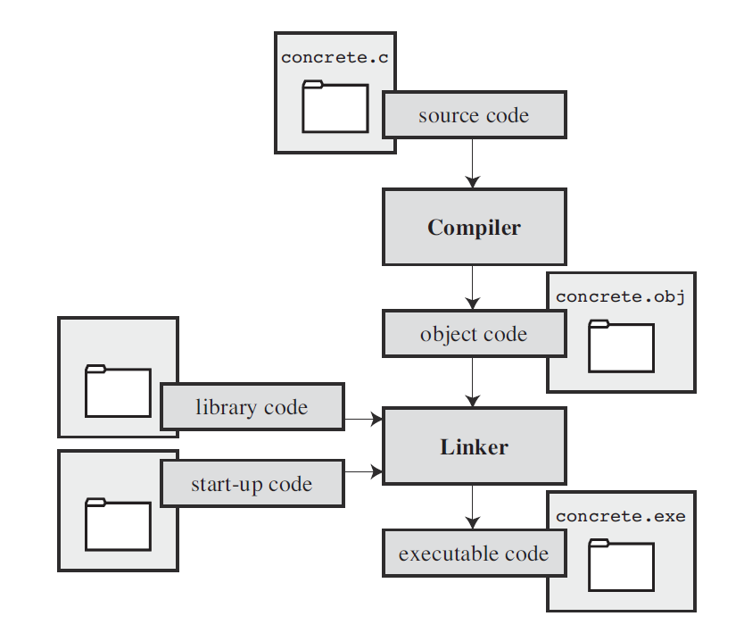

# C Primer Plus

>*Sixth Edition*  
*Stephen Prata*  
*2014, Pearson Education, 2016, 人民邮电出版社, 中南大学图书馆*  
*2019.6.28 - 8.21 长沙, 萍乡*

---

#### CONTENTS
* [Introduction](#introduction)
* [Data and C](#data-and-c)
* [Operators, Expressions and Statements](#operators-expressions-and-statements)
* [Looping](#looping)
* [Branching and Jumps](#branching-and-jumps)
* [Character I/O and Input Validation](#character-io-and-input-validation)
* [Functions](#functions)
* [Arrays and Pointers](#arrays-and-pointers)
* [Character Strings and String Functions](#character-strings-and-string-functions)
* [Storage Classes, Linkage, and Memory Management](#storage-classes-linkage-and-memory-management)
* [File Input/Output](#file-inputoutput)
* [Structures and Other Data Forms](#structures-and-other-data-forms)
* [Bit Fiddling](#bit-fiddling)
* [The C Preprocessor](#the-c-preprocessor)
* [The C Library](#the-c-library)

---

## Introduction

**Interpreted Language** and **Compiled Language**

<div align="center">

</div>

## Data and C

#### Immediate suffixes
All suffixes are case-insensitive. 但是为了避免混淆，不建议使用小写 `l`。

Suffix | Type
:---: | :---:
`L` | long (long int or long double)
`LL` | long long int
`u` | unsigned (unsigned int etc.)
`f` | float

## Character Strings and Formatted I/O

#### `printf()` Formatters

Formatter | Format | Example Output
:---: | :---: | :---:
`%d`, `%i` | decimal | `127`
`%o` | octal | `177`
`%#o` | octal with prefix | `0177`
`%x`, `%X` | hexademical | `7f`, `7F`
`%#x`, `%#X` | hexademical with prefix | `0x7f`, `0X7F`
`%u` | unsigned decimal
`%c` | `char` |
`%f` | `float` and `double` | `0.636620`
`%e`, `%E` | exponential notation | `6.366198e-001`, ...
`%a`, `%A` | hexademical | `0x1.45f307p-1`
`%g`, `%G` | use `%f` or `%e` ( `%F` or `%E` )
`%p` | pointer
`%s` | character string
`%%` | a percent sign

#### `printf()` Modifiers

Modifier | Meaning | Example
:---: | :---: | :---:
*digit(s)* | min field width | `%4d`
.*digits* | precision | `%.2f`, `%5.2f`
`h` | `short int` or `unsigned short int` | `%hu`, `%6.4hd`
`hh` | `signed char` or `unsigned char` 
`j` | `intmax_t` or `uintmax_t`
`l` | `long int` or `unsigned long int` | `%ld`, `%lu`
`ll` | `long long int` or `unsigned long long int`
`L` | `long double` | `%Lf`, `%10.6Le`
`z` | `size_t` (returned by `sizeof`)
`-` | begin at the left of the field | `%-20s`
`+` | print plus sign if positive | `%6.2f`
*space* | leading space if positive 
`#` | conversion specification
`0` | fill with leading zeros

When `.digit` is applied to `%s`, for example, `%.5s`, only the first 5 characters will be displayed. `.f` is equivalent to `.0f`.

#### Return Value of `printf()`

It returns the number of characters it printed. Returns a negative value on error.

#### Conversion Specifiers of `scanf()`

Cnv. Spcfr. | Meaning
:---: | :---:
`%c` | character
`%d`, `%i` | signed decimal integer
`%e`, `%f`, `%g`, `%a` | float
`%E`, `%F`, `%G`, `%A` | float
`%o` | signed octal integer
`%p` | pointer
`%s` | string
`%u` | unsigned decimal integer
`%x`, `%X` | signed hexademical integer

#### Modifiers of `Scanf()`

Modifier | Meaning | Example
:---: | :---: | :---:
`*` | supress assignment 
*digits(s)* | maximum field width | `%10s`
`hh` | `signed char` or `unsigned char` | `%hhd`, `%hhu`
`ll` | `long long` or `unsigned long long` | `%lld`, `%llu`
`%hd`, `%hi` | `short int`
`%ho`, `%hx`, `%hu` | `unsigned short int`
`%ld`, `%li` | `long`
`%lo`, `%lx`, `%lu` | `unsigned long`
`%le`, `%lf`, `%lg` | `double`
`%Le`, `%Lf`, `%Lg` | `long double`

#### `scanf()` 的工作方式

假设使用的是 `%d` 模式，`scanf()` 开始读字符，忽略开始出现的空白字符直到输入中有了数字或者符号（`+`、`-`），`scanf()` 将它们保存下来，直到又遇到一个非数字字符。这时候这个字符会被放回**输入缓冲区**。这意味着程序下一次读入字符的时候，这个被放回的字符会作为第一个字符出现。接下来 `scanf()` 会根据 `%d` 将接受的字符转换为带符整数，存入所给出的地址处。

如果第一个非空白字符非数字非符号，那么 `scanf()` 不会给任何变量赋值并且把这个字符退回输入缓冲区，所以下一个输入遇到的第一个字符还是这个字符。如果下一个 `scanf()` 也使用 `%d`，那么它也不会有任何反应。

其它的数字模式和 `%d` 相似，只是 `scanf()` 能接受更多的合法字符，比如十六进制中的 `A`-`F`，十六进制小数的 `p` 记号。

在 `%s` 模式下，`scanf()` 从读到的第一个非空白字符开始保存，直到又遇到的第一个空白字符。

在 `%c` 模式下，所有的字符都是平等的，都会被保存下来。

转换标识符之间还可以有普通字符，比如 `%d,%d` 。这样的情况下，输入完第一个整数之后必须紧跟逗号，否则第二个整数输入无效。但是逗号之后又要输入一个整数，所以这里输入的空白字符会被跳过。

#### Return Value of `scanf()`

It returns the number of items it successfully reads. If it reads no items, it returns 0. If it reaches EOF, it returns EOF.

#### The `*` Modifier

在 `printf()` 中，`*` 意味着可以用变量来指明 field width、precision 等 modifier 量。如下例。
```c
int width = 4, precision = 2;
float f = 3.1415927;
printf("%*.*f", width, precision, f);
```

在 `scanf()` 中，`%` 和 转换标识符之间的 `*` 代表忽略对应的输入。如
```c
scanf("%*d %*d %d", &n);
```
当中第三个输入才有效。

## Operators, Expressions and Statements

#### `sizeof` Operator

`sizeof` returns a size_t type value. It has a `printf()` specifier `%zd`. But actually it is the same to unsigned int or unsigned long int. If the compiler does not support `%zd`, try `%u` or `%lu` instead.

#### `++` and `--`

在同一表达式中，`++` 具体何时执行并不确定，比如 `n+n++` 的值是不确定的。但是逗号表达式一定是从左到右执行的，`n, n++` 的各项之值均确定。

#### Precedence

圆括号 `()` 优先级最高，其次是 `++` 和 `--`，然后是一元符号 `+` 和 `-`，接下来是乘除 `*` `/`、加减 `+` `-`，最后赋值 `=`。

## Looping

#### Boolean

`_Bool` 类型的变量可被赋值为 0 或 1。如果向其赋非零值，则会自动转换为 1。但是并未定义 `true` 和 `false` 两个量。

Furthermore, by including the `stdbool.h` file, you can use `bool` instead of the key word `_Bool` for the type and use the indentifiers `true` and `false`.

#### C-Style Reading Loop

```c
while (scanf("%d", &n) == 1)
{
    // loop actions
}
```

可以使用 `n = getchar()` 代替。这样的效果完全一样，差别只在 `getchar()` 略快一些。对应的是 `putchar()` 函数。

#### `for` Loop

`for` 循环的过程：首次循环之前初始化，每次循环之前比对条件，每次循环结束后更新。

#### `do-while` Loop

```c
do
{
    // loop actions
} while(CONDITION)
```

#### 判断质数

```c
for(int i=2; i*i<=n; i++)
    ...
```

#### 读取每行第一个字符

```c
while((c = getchar()) == '#')
{
    ...
    while(getchar() != '\n')
        continue;
}
```

## Branching and Jumps

#### `ctype.h`

Function | Test
:--- | :---
`isalpha()` | 
`isalnum()` |
`isblank()` | standard blank character (*space*, `\t`, `\n`)
`isspace()` | whitespace character
`iscntrl()` | control character
`isdigit()` |
`isxdigit()` | hexademical-digit character
`isprint()` | printing character
`isgraph()` | printing character other than space
`islower()` |
`isupper()` |
`ispunct()` | 
`tolower()` |
`toupper()` |

#### `iso646.h`

`and` $\longleftarrow$ `&&`  
`or` $\longleftarrow$ `||`  
`not` $\longleftarrow$ `!`  

#### Precedence

`!` 的优先级和自增自减运算符一样高。而关系运算符高于 `&&` 高于 `||` 高于赋值符。

#### Order of Evaluation

逻辑运算符保证从左到右运算。并且当前一项已经可以确定整个表达式的值时，后一项便会被忽略。

#### `switch`-`case` Statement

```c
switch (VARIABLE)
{
case CONSTANT1: 
    STATEMENT;
    break;
case CONSTANT2a:
case CONSTANT2b:
    STATEMENT;
    break;
default:
    STATEMENT;
}
```

若无 `break` 语句，则程序执行完一个 `case` 之后不会跳出而是执行下面的语句。当然 `continue` 不能作用于 `switch`。

## Character I/O and Input Validation

#### End Of File

`EOF` is defined in the `stdio.h` file as follows:
```c
#define EOF -1
```
当 `getchar()` 读到文件结束标志时返回 `EOF`。`EOF` 的具体值可能会有变化，但是通过符号化的定义屏蔽了这个细节。可用 `Ctrl+D`（Unix）或者 `Ctrl+Z`（Windows）输入。

#### Input Validation

需要输入一个正整数时，可以使用
```c
long n;
while (scanf("%d", &n) == 1 && n >= 0)
{
    while (getchar() != '\n');
    ...
}
```

## Functions

#### Equality of Functions

任何函数都可以被另外的任何函数调用，包括 `main()`。

#### Inline Function

C99 引入了内联函数。和 C++ 一样，这只是一种建议性的指令，编译器将视情况将函数内联。内联函数没有地址，因此如果源代码中出现了对其取地址的操作，则函数不会被内联。

#### `_Noreturn` Functions

C11 引入无返回函数，即函数执行完毕后不会回到调用它的地方。`exit()` 就是一种无返回函数。

#### 编译多文件源码

使用 gcc 编译器，只需要执行
```
gcc file1.c file2.c
```
即可。如果其中有文件已经编译为目标文件，还可以
```
gcc file1.c file2.o
```

一般将 `main()` 函数和函数定义分别置于不同的文件，但此时 `main()` 还是需要函数原型。一般的做法是将函数原型和预处理语句放在头文件中，而在每一个文件中使用 `#include` 包含使用到的头文件。

## Arrays and Pointers

#### 数组名和指针的不同

指针可以是常量或者变量，但是数组名一定是常量，不可以改变它的值。

#### 常量数组初始化

常量数组必须在定义时赋初值
```c
const int arr[4] = {0, 1, 2, 3};
```

#### 指定元素初始化

C99 规定了指定元素初始化（designated initializers）
```c
int arr[6] = {1, 2, 3, [5]=212};
```
后初始化的元素可以覆盖之前初始化的结果。

#### 指定上限

C99 规定了使用正整数变量指定数字长度，如
```c
int n = 5;
int a[n];
```

#### 数组形参

```c
int foo(int arr[]);
```
```c
int foo(int * arr);
```

在数组被定义的函数中，使用 `sizeof` 得到的是整个数组所占字节数，而经过参数传递到另一个函数中使用 `sizeof` 之后得到的是该指针的大小。

#### 常量参数

向函数传递数组参数时，只能传送地址。这会导致函数对数组做意外修改的危险。为了保护参数不被修改，可以使用常量参数。

```c
int sum(const int arr[]);
```

#### 常量与指针

指向常量的指针定义为
```c
const int * p = &a;
```
事实上他可以指向常量或者变量，但不可以通过指针来**改变所指向的值**。指针本身可以改变指向地址。这种用法经常用于函数形参，表明函数不能通过这个指针来改变所指向的值。

注意普通指针不可以指向常量。

常指针的定义为
```c
int * const p = &a;
```
这种指针不可以**改变所指的地址**，但可以改变所指向的值。

最后还有
```c
const int * const p = &a;
```
这个指针既不可以改变指向，也不可以改变指向的值。

#### 函数指针

函数指针常用于传参。函数的地址就是函数名。只要函数的参数列表类型相同，它们的地址类型就相同。
```c
void f();
void (* pf)();
pf = f;
```
函数指针和函数名都可用于调用函数，即 `pf()` 和 `f()` 是一样的。

#### 指针与多维数组

以下面的数组为例讨论指针和多维数组
```c
int arr[4][2];
```
多维数组就是数组的数组，`arr` 的元素，也就是 `arr[k]`，是包含两个 `int` 的数组。所以，`arr + 1` 移动了两个 `int` 单位，而 `arr[0] + 1` 只移动一个 `int` 单位。

同样地，`*arr[0]` 是这个数组的第一个值。而 `*arr` 是数组 `arr[4]` 的第一个值，这个值是一个数组，也就是它本身又是一个指针，这样又能得到 `**arr`、`*&arr[0][0]`、`arr[0][0]` 都是一回事。反过来看 `arr` 是地址的地址。

#### 指针数组与数组指针

```c
int * p[2];
```
首先作用的下标运算符，表明 `p` 是一个数组。`*` 表示数组元素是指针，之后是 `int` 类型，所以定义的是指针组成的数组。

```c
int (*p)[2];
```
首先 `*` 表明 `p` 是指针，下标运算符表示指向的是双元素的数组。

这样的数组指针可以用来指向多维数组。以下面的代码为例：
```c
int arr[4][2] = {};
int (*p)[2];
p = arr;
```
这样 `p + 1` 后移两个整数空间，`p[0] +1` 后移一个整数空间。`arr[m][n]` 和 `p[m][n]` 是同一回事。

#### 指针类型兼容

指针没有自动类型转换，只要指向的类型不同，就不可以相互赋值（`void*` 是唯一的例外）。

指向同类型常量和变量的指针可以相互赋值。显然将常量的地址赋值给变量的指针是不安全的，但事实上 `MingGW` 只会给出警告，而且通过这个指针可以改变常量的值。

同时，多重指针的赋值也可能不安全。

C++ 中不允许将变量指针指向常量。

#### 多维数组形参

多维数组作为函数的形参时需要确定除第一个下标之后的所有下标限。
```
void sum(int arr[][2]);
void prd(int (*arr)[2]);
```
两种写法是等同的，甚至可以在函数原型和定义两处使用两种语法。

#### Variable-Length Arrays (VLAs)

顾名思义，这是用变量定义长度的数组。注意，这不是“变长数组”，在定义之后，数组的长度不可改变。

首先，使用变量作为定义数组时的下标限。此时如果直接初始化，可能会出错。在函数形参中也可以使用 VLA，具体方法是
```c
int sum(int i, int j, int arr[i][j]);
```
如果在函数原型中省略变量名，则需要
```c
int sum(int, int, int arr[*][*]);
```
需要指出的是，这里的 VLA 形参仍是指针。

#### Compound Literal

Literals are constants that are not symbolic.
```c
int p;
p = (int [2]){10, 20};
```

这样的常量可以使用于赋值，传参等等，和普通常量一样。


## Character Strings and String Functions

#### Character String Literals

双引号之间的字符就是字串常量，它们会自动在末尾附上一个 `\0`。若两个字串之间仅有空白字符，则它们会合并。这些字串存储在静态区，而且这个字段代表的就是指向它的指针。

```c
printf("%s, %p, %c", "abc", "def", "ghi");
```
```
abc, 0x100000f61, g
```

#### 字符数组初始化

可以使用双引号或者大括号形式初始化字符数组。双引号形式自动添加末尾空字符，但是大括号形式必须手动加。没有末尾空字符的字符数组不能称作字符串。

如果数组下标比初始化所需的更大，则多余空间都会初始化为 `\0`。

#### 字符数组和字符指针

既然双引号是指针，那么就有两种初始化方法
```c
char str[] = "Hello";
char * ptr = "World";
```
这两种定义方式很相似但是还是有细微区别。

程序执行前，双引号内的字符先存入静态区，待到执行以数组方式定义字符数组时，再将其复制到数组所在内存单元中。但是指针形式只会复制此地址。

这样导致的结果是，指针形式的字符串通过指针改动后，可能导致在执行过程中程序中出现的同样的字串常量（character string literals）随之改变。总而言之，不要改变指针形式定义的字符数组。

当然，和普通数组一样，数组名是常指针，而指针形式初始化的是可变指针。

#### 字符串的数组

同样地，字符串数组可以通过字符数组的数组和字符指针的数组实现。这两种是不同的类型，因为首先它们所占大小不同，前者占空间为由下标计算，而后者只占指针数×字符指针大小的空间。在此之上，它们代表的字符也不同，数组方式首先复制静态区中的字符串，若字符串不是同一长度，那么就会自动 `\0` 占位，而指针形式不存在这种情况。同样地，如果需要改变字符串内容，不要使用指针形式。

### 字符串输入

#### 空间分配

输入字符串之前必须分配空间，下面是一种非常危险的做法：
```c
char * str;
scanf("%s", str);
```

#### `gets()` 函数

```c
char str[15];
gets(str);
```

`gets()` 函数读入一行数据，并截去末尾换行，再添加上 `\0`。这个函数并不安全，因为它不判断输入的字符是否超出分配的空间，导致可能会覆盖其他数据。C11 已经取消了该函数，但是大多数编译器为了向前兼容，还保留了这一函数。

#### `fgets()` 函数

`fgets()` 用于从文件输入。第一个参数是字符数组名（指针），第二个参数是字符上限，第三个参数是源文件指针。它从源文件读入字符串，直到 `\n` 出现或者达到上限。如果是从控制台输入，则源文件为 `stdin`。此函数不会丢弃末尾换行符。

函数返回一个 `char*` 指针，一般情况下和第一个参数一致，但是如果函数读到了 `EOF`，则返回 `NULL` 指针。

多个 `fgets()` 可以处理比上限长的字符串，首先第一个 `fgets(str, n, stdin)` 从缓冲区读入 `n-1` 个字符，之后附上 `\0`，下一次读入时，再断点处继续，重复前一过程。

#### `gets_s()` 函数

C11 加入了可选的 `gets_s()` 函数，它接受两个参数，首先是字符数组名称，然后是字符数上限。它从控制台读入字符，读到换行符时停止并丢弃换行符。如果字符超限，那么它会将目标字符数组的第一个字符设为 `\0`，然后丢弃剩下的输入，并且可能会导致程序退出。

### 字符串输出

#### `puts()` 函数

输出一个字符串，并附上换行符。这里有一个用法是直接传入参数 `&str[n]` 以从第 `n+1` 个字符开始显示。

#### `fputs()` 函数

此函数接受两个参数，第一个是要输出的字符数组名，第二个是输出目标文件指针，如果从控制台输出，则为 `stdout`。它不会自动加上换行符。

如果没有合适的标准输入输出函数，可以使用 `getchar()` 和 `putchar()` 自定义。

### 字符串函数

以下函数声明于 `string.h` 头文件。

#### `strcat()` 和 `strncat()` 函数

它接受两个字符串数组，将第二个拼接到第一个末尾（第二个本身保持不变），然后返回第一个参数。这个函数不检查是否溢出，因此可能导致覆盖其他数据。

`strncat()` 在 `strcat()` 的基础上再接受第三个参数，标明拼接时增加的字符串长度上限。

#### `strcmp()` 和 `strcmp()` 函数

直接比较字符数组名称是在比较它们的地址而非其内容。因此需要 `strcmp()` 函数，它在两个字符串相等时返回 0，若不相等，则返回值的符号和第一个字符串减第二个字符串在第一处差异处的差符号相同。

同样地 `strncmp()` 加上了上限。

#### `strcpy()` 和 `strncpy()` 函数

这一组函数相当于字符串的赋值。值得注意的是其中的参数并不一定要指向字符数组的开头

#### `strchr()` 和 `strrchr()` 函数

```c
char * strchr(const char * s, int c);
```
返回指向 `s` 第一次出现的字符 `c` 的指针。`strrchr()` 则对应最后一个出现的 `c`。未找到则返回 `NULL`。

#### `strstr()` 函数

```c
char * strstr(const char * s1, const char * s2);
```
返回指向 `s2` 在 `s1` 中第一次出现处的指针，未找到则返回 `NULL`。

#### `strpbrk()` 函数

```c
char * strpbrk(const char * s1, const char * s2);
```

返回指向 `s2` 中任一字符在 `s1` 中第一次出现的位置的指针，未找到则返回 `NULL`。

#### `sprintf()` 函数

此函数定义在 `stdio.h` 中，它和 `printf()` 非常相似，区别在于它输出到字符串而非控制台。`sprintf()` 的第一个参数是目标字符数组，之后的参数和 `printf()` 一样，根据这些生成的字符串存入之前的字符数组中。

### 字符串-数字转换

`stdlib.h` 中包含一系列转换函数。

`atoi()` 函数（alphanumeric to integer）将字符串转换为整型，它返回字符串开头的纯数字部分所转换为的数字。如果参数开头不包含数字，则它的返回值未规定。同样地，还有返回 `double` 类型的 `atof()` 和返回 `long` 的 `atol()`。

`strtol()` 函数将字符串转换为 `long` 类型。
```c
long strtol(const char * str, char ** endp, int base);
```
首先将 `str` 开头可转换的部分转换为 `long` 并返回，可选择从 1 到 36 的基数。随后 `endp` 指向未得到转换的第一个字符的地址的地址。同理有 `strtoul()` 函数。

`strtod()` 函数则转换为 `double` 类型，但是没有基数选择，只接受两个参数。

一些编译器提供数字向字符串的转换函数如 `itoa()` 和 `ftoa()`，但是它们不是 C 标准。一般使用 `sprintf()` 函数。


## Storage Classes, Linkage, and Memory Management

### Storage Classes

#### Scope

所谓作用域，是指一个量能被访问的范围。

C 变量有以下几种作用域：
* 块作用域（block scope）
* 函数作用域（function scope）
* 函数原型作用域（function prototype scope）
* 文件作用域（file scope）

“块”（block）是一对花括号内的部分。一个函数是一种块，单独用花括号包围的也是块。C99 又将这个概念扩展到了 `if`、`while`、`for` 语句，无论是否使用花括号。

函数作用域指 `goto` 的语句标记的作用域是它所在的整个函数。

函数原型作用域是指原型中形参作用域仅限于原型。注意原型中的变量名和定义不需一致。

在函数之外定义的量则有文件作用域，即整个文件均可访问。注意 translation unit 的概念：一个源代码文件可能包含头文件，这样从存储上来看编译的是多个文件，但是事实上 C 编译器在 `#include` 语句处直接将头文件的源代码替换进来，这样看来就是一整个文件，这个文件就是一个 translation unit。

#### Linkage

块作用域、函数作用域和函数原型作用域的变量没有链接。只有文件作用域的可以有内部链接 `internal linkage` 或者外部链接 `external linkage`。 内部链接在一整个文件（Translation Unit）中使用，而外部链接可以在整个程序的多个文件中使用。

#### Storage Duration

存储期描述的是存储单元的分配和释放。

存储期分为四种：
* 静态（static）
* 线程（thread）
* 自动（automatic）
* 分配（allocated）

静态存储单元在整个程序运行过程中都有效。注意这里的 `static` 关键词声明的是链接而不是存储期。线程存储期的单元仅在该线程中有效，并且每一个新线程都能分配的到一个独立的量。自动存储期的存储单元在整个代码块中有效，但是一个例外是 VLA 只在声明之后的块中有效。

任何存储在静态区的变量若未显式地赋初值，则默认初始化为 0，包括数组中的元素。

由于本书不涉及并行编程，而且分配存储类型在内存管理中讨论，所以这里总结五种存储类型：

Storage Class | Duration | Scope | Linkage | How Declared
:---|:---|:---|:---|:---
automatic | Automatic | Block | None | In a block
register | Automatic | Block | None | In a block with `register`
static with external linkage | Static | File | External | Outside functions
static with internal linkage | Static | File | Internal | Outside functions with `static`
static with no linkage | Static | Block | None | In a block with `static`

#### Automatic Variables

默认情况下，在代码块或者函数定义首部定义的变量为自动变量。还有一种定义方式是在类型之前加上关键字：
```c
auto int a;
```

但是 C++ 中关键字 `auto` 用于别的用途，所以为了兼容性，不建议使用。

自动变量在所定义的代码块及其子代码块中有效。当这个代码块结束运行时，该变量就会被释放，若该代码块下一次运行，则这些变量会重新创建。若子代码块中定义了同名变量，则会将上一级代码块中的屏蔽。若在定义自动变量时没有初始化，则它的初始值不确定。

C99 规定 `if` 和循环语句本身也是一个代码块，这些语句中的代码块是它的子代码块。比如
```c
for (int i = 0; i < n; i++)
{
    // sub-block
}
```
以上整个语句是一个块，而花括号当中是它的子代码块。

#### Register Variables

寄存器变量使用 `register` 关键字定义：
```c
register int r;
```
这种变量大体和自动变量相同，但是由于它存储在寄存器中，所以速度较快，同时没有地址，不能取地址，不能被指针指向。定义一个寄存器变量并不一定让这个变量存储在寄存器中，编译器会做出衡量，最终决定是否存入寄存器。即使未存入寄存器，也不能取地址。

寄存器变量可以用于声明函数形参。

#### Static Variables with Block Scope

静态变量存储在内存的静态区内。在代码块中的静态变量又称为“局部静态变量（local static variable）”或者“内部静态变量（internal static storage class）”：
```c
static int s;
```
这种变量只能在所在代码块中访问，但是其存储单元在整个程序运行时都有效。事实上定义静态变量所在的函数在重复执行时会跳过这一段对应的机器码，以防止重新声明造成的覆盖。

#### Static Variables with External Linkage

外部链接静态变量在整个程序的多个文件中都有效。它直接在函数外部定义：
```c
int e;
```
这样的声明并不会直接使其他文件对此变量有访问权，若其它文件需要使用，则必须要使用的文件的函数外部加上 `extern` 声明以获得访问权。也就是说多个文件中，除了第一次定义处不使用 `extern`，其它需要使用该变量的文件均需要此声明。
```c
extern int e;
```

C99 和 C11 标准规定编译器识别局部标识符前 63 个字符，外部标识符前 31 个字符，之前的规定是 31 和 6。

函数中还可以可选地再加上 `extern` 声明
```c
extern int e;
```
注意此语句并没有定义变量，只是声明，称为 referencing declaration。而第一次的声明中包含了定义，称为 defining declaration。这种声明不需要重新表明数组的长度。如果缺少了 `extern` 关键字，则会导致创建一个将外部变量隐藏的同名自动变量。

#### Static Variables with Internal Linkage

这种变量能在整个文件（translation unit）中访问，它曾经叫做外部静态变量（external static），但是为了避免混淆，我们弃用这一名称。这种变量在函数外部声明
```c
static int i;
```
亦可以在函数中加上引用声明
```c
extern int i;
```
但是不会改变这个变量的链接种类。

#### Storage-Class Specifier

C 语言一共有六种存储类型关键字：
* `auto`
* `register`
* `static`
* `extern`
* `_Thread_local`
* `typedef`

`static` 说明变量存储在静态区，但是变量的访问权还需要由上下文确定。`extern` 说明正在声明的变量在别处定义。

函数同样也有存储类型，除了 C99 的内联函数，只有外部函数和静态函数。默认的外部函数可以在多文件访问，而加上 `static` 关键字的函数只能在该文件中使用。其 `extern` 关键字的使用方法和变量相同。

### Allocated Memory

`stdlib.h` 头文件中提供了动态内存分配函数。

`malloc()` 接受申请空间字节数作为参数，返回指向这个空间第一个字节的指针。若分配失败则返回 `NULL`。这个指针的类型，在 ANSI C 之前是 `char*`，现在为 `void*`。为了可读性，应该显式声明指针类型，但是不声明不会引起错误，即使是 ANSI C 之前。
```c
double * p;
p = (double * p) malloc(30*sizeof(double));
```
注意这个类型转换虽然在 C 中可省略，但是 C++ 要求使用。

每一个 `malloc()` 都应与一个 `free()` 配对。`free()` 将参数指向的动态内存块释放。如果不将动态分配的内存释放，则它们会占用空间一直到程序结束。

`stdlib.h` 中的 `exit()` 使整个程序退出。其参数为退出返回值，一般用 `EXIT_SUCCESS`（== 0）或者 `EXIT_FAILURE`，也可以用其它整数来表明错误。

`calloc()` 函数用于分配一组内存空间，接受两个无符号数作为参数：
```c
int * p;
p = (int *) calloc(100, sizeof(int));
```
它的返回值和 `malloc()` 完全一样，同样需要使用 `free()` 释放。有一点不同是它会将分配的内存中的每一位都初始化为 0（注意有一些系统中，每一位都是 0 所代表的浮点数并不是 0）。

### Type Qualifiers

C 语言有四种类型限定词：
* `const`（C90）
* `volatile`（C90）
* `restrict`（C99）
* `_Atomic`（C11）

C99 之后限定词是幂等（idempotent）的，即连续的多个限定词相当于一个。
```c
const const const int i = 0;
const i = 0;
```
两行代码效果完全相同。这样做的目的是使得以下代码有效：
```c
typedef const int cint;
const cint i = 0;
```

#### The `const` Type Qualifier

首先注意 `const` 限定词和指针。定义在指针时，若 `const` 在 `*` 之前，则说明指针指向常量，而若 `const` 在 `*` 之后，说明指针本身是常量。即
```c
const int * pointer_to_const_a;
int const * pointer_to_const_b;
int * const constant_pointer;
```

跨文件全局常量有两种处理方法。一种是采用外部链接的静态常量，即先在一个文件中定义
```c
const double PI = 3.14;
```
在其它文件中声明
```c
extern const double PI;
```

或者将常量写入头文件中，再在各个文件中引用。这样的常量一定要用 `static` 定义，否则会导致同一个变量定义多次，引起错误。这样各个文件中的常量事实上是完全独立的，但是由于它们不变化，所以没有影响。

#### The `volatile` Type Qualifier

`volatile` 变量允许被非此程序的代码改动。这样做的目的是通知编译器此变量在两次使用之间虽然没有代码改动，但是可能被外部改动，因此不允许将其缓存在寄存器中。

`volatile` 和 `const` 限定符不冲突，而且它们的顺序无关紧要。

#### The `restrict` Type Qualifier

`restrict` 也用于编译器优化，避免大量的冗余读取指针内容。它只能用于指针，它说明此指针是改变其所指单元内容的唯一、初始的方式。即不能通过其他方式改变其所指向的值，而且之前无法改变此值。
```c
int * restrict p = (int *) malloc(sizeof(int));
```
亦可以在函数形参做 `restrict` 限定，这说明在函数中没有其他方式改变该值。

有一些编译器并不会检查 `restrict` 变量是否满足要求。

#### The `_Atomic` Type Qualifier

原子型变量在并发程序中使用。当原子变量在一个线程中进行原子操作时，其他线程不会访问该变量。


## File Input/Output

### Standard I/O

标准输入输出使用 C 库函数，函数原型存放在 `stdio.h` 中。由于不同的操作系统提供不同的底层 I/O，所以一般使用移植性好的标准 I/O。同时，标准 I/O 有各种不同功能的函数以及缓冲机制。

#### The Text Mode and the Binary Mode

The text mode and the binary mode are two ways that C accesses files. The binary mode access every byte of the file, while the text mode is a little bit different. For example, `\r\n` will be converted to `\n` in text mode on Windows.

#### Standard Files

C 程序自动地打开三个文件：standard input、standard output、standard error output。它们都通过控制台输入，而独立出标准错误输出的目的是为了有逻辑上独立的错误报告。

#### The `fopen()` Function

`fopen()` 接受两个参数，第一个是代表文件路径的字符串，第二个是打开文件模式的字符串。

模式 | 含义
:---|:---
`"r"` | 读模式
`"w"` | 写模式，若文件已存在则覆盖，不存在则创建
`"a"` | 追加模式，若文件已存在则追加，不存在则创建

在代表模式的字符后还可以加上后缀，如 `"r+"`、`"w+bx"`、`"ab+"`。后缀顺序任意。

后缀 | 含义
:---|:---
`+` | 可同时读写
`b` | 二进制模式
`x` | 其他线程不能占用该文件，若文件已存在则失败

注意含有 `a` 和 `+` 的模式中，可以读整个文件，但是只能以追加模式写入。`x` 为 C11 标准规定，只能用于 `w` 及其扩展。

`fopen()` 返回的是 `FILE*` 指针。

#### The `getc()` and `putc()` Fucntion

`getc()` 从所指定的文件指针中获取一个字节。事实上 `getchar()` 和 `getc(stdin)` 是等价的。同样地，`putchar(ch)` 和 `putchar(ch, stdout)` 是等价的。

`getc()` 在读到文件末尾时返回 `EOF`，所以一种常用的写法是
```c
FILE * fp = fopen("temp.txt", "r");
while ((ch = getc(fp)) != EOF)
{
    ...
}
```

#### The `fclose()` Function

`fclose()` 的参数是一个文件指针，函数将其指向的文件关闭。如果关闭成功则返回 0，失败则返回 EOF。

#### The `fprintf()` and `fscanf()` Function

这两个函数和和 `printf()` 与 `scanf()` 非常相像，不同的是在要在之前加上一个文件指针参数。

#### The `fgets()` and `fputs()` Function

[`fgets()` 函数](#fgets-函数)  
[`fputs()` 函数](#fputs-函数)

#### The `fseek()` and `ftell()` Function

```c
int fseek(FILE * fp, long offset, int fromwhere);
``` 
`fseek()` 将 `fp` 移动到指定的位置，这是一种随机访问文件的方法。其中，`offset` 可正可负，但注意必须为 `long` 类型，在直接用数字表示时需要加上 `L` 后缀。`fromwhere` 有三种模式选择：
* `SEEK_SET` 文件开头
* `SEEK_CUR` 当前位置
* `SEEK_END` 文件结束

如果执行正常，返回 0，否则返回 -1（比如超出文件界限）。

```c
long ftell(FILE * fp);
```

`ftell()` 返回指针 `fp` 到文件开头的距离，用于和 `fseek()` 配合使用。

在二进制模式中，这两个函数可以精确地根据字节数做相应的操作，但是在文本模式中，会有一些偏差。尽管如此，根据 ANSI C 中的规定，它们的配合是没有问题的。

这两个函数为 UNIX 文件而设计，在其它操作系统上不一定可以完全正常运行，比如二进制模式 `SEEK_END` 模式可能出错。但文本模式中，只要 `offset` 为 `0L`，或者模式为 `SEEK_SET`，就一定可以正常工作。

#### The `rewind()` Function

`rewind()` 接受一个文件指针，使其回到文件的开始位置。

#### The `fgetpos()` and `fsetpos()` Function

前面两个函数限于使用 `long` 来指示文件位置，这样就将文件访问的范围限制在了二十亿字节左右。为了解决这个问题，引入了一种复合类型 `fpos_t`，用于表示文件指针位置。这种类型是一种复杂的结构，不能用于定义数组。

```c
int fgetpos(FILE * fp, fpos_t * pos);
``` 
`fgetpos()` 将当前 `fp` 指向的位置到文件起始的距离赋值给 `pos`。同时返回 0。若操作失败，则返回非零值。

```c
int fsetpos(FILE * fp, const fpos_t * pos);
```
同样地，`fsetpos()` 将 `pos` 所表示的到文件开头的距离转换为文件指针，赋值给 `fp`，返回值同上。

#### The `ungetc()` Function

```c
int ungetc(int c, FILE * fp);
```
将字符 `ch` 压回 `fp` 的缓冲区中。

#### The `fflush()` Function

```c
int fflush(FILE * fp);
```
将输出缓冲区的内容写入 `fp` 中。若 `fp == NULL` 则清空所有输出缓冲区。它对输入缓冲区的作用未定义。

#### The `setvbuf()` Function

```c
int setvbuf(FILE * fp, char * buf, int mode, size_t size);
```
将 `buf` 处长度为 `size` 的空间设置为 `fp` 的缓冲区。模式 `mode` 有三种可选：
* `_IOFBF`（fully buffered）
* `_IOLBF`（line-buffered）
* `_IONBF`（non-buffered）

#### The `fread()` and `fwrite()` Function

存储浮点数时使用二进制形式，可以避免精度损失，而且占用空间小。
```c
size_t fwrite(void * p, size_t size, size_t nmem, FILE * fp);
```
向 `fp` 处写入从地址 `p` 开始的 `nmem` 单元个，大小为 `size` 字节的数据。返回值是成功写入的数据个数，一般情况下等于 `nmem`。例如
```c
double buf[3] = {1.2, 3.4, 5.6};
fwrite(buf, sizeof(double), 3, fp);
```


```c
size_t fread(void * p, size_t size, size_t nmem, FILE * fp);
```
`fread()` 和 `fwrite()` 使用同一套参数，互为相反操作。

#### The `feof()` and `ferror()` Function

它们都接受一个 `FILE*` 参数，若检测到 EOF/错误，则返回非零值，正常则返回 0。


## Structures and Other Data Forms

### Structure

有多种方法定义结构体，一般的做法是首先声明结构体的形式（structure template），然后定义具体的变量。
```c
struct book {
    char title[60];
    float value;
};
struct book lib;
``` 
上例中声明了一种名称（tag）为 `book` 的结构体，这种声明使得 `struct book` 代指花括号内各成员的声明。亦可以此声明与定义合并，若只使用一次，还可以不给此结构体种类命名。

结构体的初始化和数组相似：
```c
struct book lib = {
    "C Primer Plus",
    118
};
```
也可以采用指定成员的初始化
```c
struct book lib = {
    .title = "C Primer Plus",
    118
};
```
或者更直接地，直接使用结构体变量初始化。

结构体可以包含任意类型包括结构体，可以组成数组，可以作为函数参数，可以作为函数返回值。

结构体类型的变量可以直接相互赋值，就算其中的成员有数组也不影响。

#### Pointers to Structures

注意 “`.`” 运算符的优先级比 “`&`” 和 “`*`” 运算符高。

指向结构体的指针到其成员的运算可以表示为 `(*p).m`，但显然写为 `p->m` 更加方便。

由于结构体可能占用比较多空间，所以在向函数传递结构体参数时，为了速度，一般的做法是传递指针而非直接传参。
```c
int foo(const struct book *);
```

结构体中不能包括自身，但是可以能包括指向自身的指针。这常在数据结构中使用到。
```c
struct node {
    int i;
    struct node * next;
};
```

#### Structure Compound Literals

Compound literals can be converted to structures, similar to arrays
```c
(struct book){
    "The Art of Computer Programming", 
    "100"
}
(struct book){
    .title = "Introduction to Robotics",
    .value = 99
}
```
如果定义在函数内，则为自动存储期，若在函数外，则有静态存储期。并且它们可以取地址。

#### Flexible Array Members

C99 规定了一种特殊的成员数组。如果一种结构体的最后一个成员是数组，并且它不是唯一的成员，那么在定义时它的下标限可以留空，称为变长成员数组。
```c
struct flex
{
    int count;
    double average;
    double scores[];
}
```
这种类型的结构体变量在定义时，并不会分配任何空间给变长成员数组。这种结构体的使用方法是手动分配空间。
```c
struct flex * p;
p = malloc(sizeof(struct flex) + 5 * sizeof(double));
p->scores[4] = 2.3;
```
这样就给变长数组分配了空间。不同的变量可以分配不同长度的空间，因此称为变长数组。

但是由于这一种结构体本身不包含变长数组的空间，所以它们在直接相互赋值时，只有非变长的部分有效。它们不可用于直接传参，不可作为数组元素，不可嵌套在其它结构体中。

#### Anonymous Structures

C11 中规定了一种新特性，称为匿名结构体。在定义嵌套结构体的时候，可以省去内结构体的定义：
```c
struct staff
{
    int id;
    struct {char first[20], char last[20]};
};
```
可以直接对其初始化，可以直接访问子结构体中的元素。
```c
struct staff a = {23, {"Stephen", "Prata"}};
a.first;
```

### Union

共用体允许将不同种类的数据存放在同一段空间。其定义形式与结构体相同：
```c
union hold {
    int digit;
    double real;
    char letter;
};
union hold a;
```
它可以有多种初始化形式：
```c
union hold a = {1};
union hold b = a;
union hold c = {.real = 7.1};
a.letter = 'r';
```
一个共用体是单个变量，在存储一种类型之后之前的数据随之被覆盖。它也可以使用 `->` 运算符。

#### Anonymous Union

C11 规定了匿名共用体。用于共用体内嵌在结构体或者共用体中。

### Enumerated Types

枚举类型是一种将整数符号化，以增强程序可读性的类型。
```c
enum spectrum {red, orange, yellow, green, blue, violet};
enum spectrum color;
```
这样，一个枚举类型可取的值称为枚举常量，和其他常量一样使用。
```c
for (color = red; color <= violet; color++)
```
但是 C++ 未继承枚举类型的一些特性，比如上例中的 `++` 运算符就和 C++ 不兼容。

枚举常量是整数，其具体类型由系统决定，比如上例中可能为 `unsigned char`。这些常量默认按顺序从 0 开始计数，也可以手动改变其值：
```c
enum levels {low = 100, medium = 500, high = 1000, highplus};
```
未指明值的常量由上一项开始计数。

枚举类型还可以用于定义符号化变量。使用一个匿名枚举类型，其中的元素代替宏或者常量。
```c
enum
{
    ROW_START = 1,
    COL_START = 1,
    ROW_END = 24,
    COL_END = 80
};

for(int i = ROW_START; i <= ROW_END; i++)
```

#### Namespaces

C 语言中，结构体，共用体和枚举类型的名称（tags）使用同一个命名空间，变量名使用另一个命名空间。这使得在同一个作用域中重名的复合类型名和变量不会导致冲突。但是注意 C++ 中它们都使用一个命名空间。

### `typedef` Keyword

`typedef` 的功能在于给自定义类型命名。
```c
typedef unsigned char BYTE;
```
注意它和 `#define` 的区别。首先 `typedef` 由编译器处理，`#define` 由预处理器处理。`typedef` 可以实现更复杂的定义，并且顺序不同，如
```c
#define STRING char *
STRING a, b;
```
```c
typedef char * STRING;
STRING a, b;
```
二者显然不同。

`typedef` 还有更复杂的用法，比如
```c
typedef struct {double x; double y;} point;
point a;
```
所声明的新类型名不一定要在右端：
```c
typedef char (* FPTRCHAR())[5];
```
定义了一种返回五元素字符指针的函数类型。这是一种复杂的类型定义，下面再看几个例子：

```c
int * a[3][4];
int (* b)[3][4];
int (* c[3])[4];
```
根据运算符优先级分析有：
* `a` 首先是二维数组，其元素是 `int` 指针； 
* `b` 是指针，指向的是一个二维数组；
* `c` 是三元素数组，其元素是指针，指向四元素 `int` 数组。

```c
char * a(int);
char (* b)(int);
char (* c[3])(int);
```
* `a` 是函数，返回值是字符指针；
* `b` 是指针，指向函数，函数返回字符类型；
* `c` 是数组，数组由指针组成，指针指向函数，函数返回字符类型。


## Bit Fiddling

### Bitwise Operators

C 语言的位运算符有：

运算符 | 名称 | 运算符 | 名称
:---:|:---|:---:|:--- 
`&` | 按位与 | `&=` | 按位与赋值
`|` | 按位或 | `|=` | 按位或赋值
`^` | 按位异或 | `^=` | 按位异或赋值
`~` | 按位取反
`<<` | 左移 | `>>` | 右移

可以使用掩码法针对特定位进行运算。使用与运算实现清零，使用或运算实现置 1，使用异或运算改变特定位。若需要测试特定位的状态，可先和掩码做与或运算，再与掩码比较。

移位运算符本身不会改变变量的值。左移运算右边补零。右移无符号类型左边补零。但是有一些机器上右移有符号数补 0，另一些补符号位。（MinGW-w64 补符号位）

### Bit Fields

位字段用于以比特为单位分配空间。它必须在结构体中使用 `signed int` 或者 `unsigned int` 类型。
```c
struct
{
    unsigned int a2 : 1;
    unsigned int a1 : 1;
    unsigned int a0 : 1;
};
```
这样分配了三个 1 位的空间。如果其中一位越界，则会存储到更高位的空间中。不同机器上存储它们的顺序可能不同。


## The C Preprocessor

#### Translating a Program

在预处理之前，C 源代码需要经过几步翻译。
1. 处理特殊字符。这里将一些多字节字符、特殊字符以及多字符标记（trigraph、digraph）转换为标准字符。Trigraph 和 digraph 是因为一些键盘不提供相关字符的输入，故 C 规定将多个字符映射到这些字符，如 `??=`、`%:` 转换为 `#`，`??>`、`<%` 转换为 `{`（此特性可能需要设置编译器）。
2. 将行末的反斜杠 `\` 连同其后的换行符删除，即将实际的多行合并为一个逻辑行。
3. 将源码分解为预处理标志（preprocessing token）、空白字符和注释，然后将每一段注释替换为一个空格。
4. 将一连串的空白字符替换为一个空格（不影响双引号中的内容）。
5. 查找预处理指令（preprocessing directive），准备开始预处理。

#### Tokens

所谓预处理标志，笼统来说就是被空白字符分开的各元素。`2 * 4` 中包含三个标志，`2*4` 则只包含一个。注意双引号及其中的字符串只算一个标志。

### The `#define` Directive

#### Manifest

最简单的使用 `#define` 的方法是直接定义符号化的常量，以及一段代码字符串，称为**宏**（macro）。宏名的命名规则和变量一样，但按惯例一般全部大写。预处理器会将此宏命令之后的宏名（双引号之间的除外）直接替换为接下来的这一段字符（宏体），直到换行为止（当然代码中的行末 `\` 已经被处理了）。

正因为宏体一直到换行为止，所以如果在行末加上分号，分号也会被视为替换的内容。

在预处理器看来，宏体是一串预处理标志，而不是一串字符，所以其中多余的空白字符会被删掉。

ANSI C 规定，重复定义一个宏名属于错误，除非两个定义中的标志是等价的。

#### Argumented `#define`

在宏中使用参数，这种宏叫做函数宏（function-like macro）。在宏名后附上括号和参数，如
```c
#define SQUARE(x) x*x
```
这样在代码中可以调用这个“函数”，将这一段替换为宏体。但是这样的效果可能和函数不同，因为这只是机械的替换字符。

例如 `SQUARE(x+2)` 会被替换为 `x+2*x+2`，显然出现了错误。解决这个问题的办法是将宏改为
```c
#define SQUARE(x) ((x)*(x))
```
但是这样依然有潜在的危险，比如 `SQUARE(++x)` 中，`x` 会自增两次。

这种宏的参数列表中允许有空格。相较于函数，含参宏速度更快，并且能处理多种变量类型。

#### 宏参数转换为字符串

在宏体中使用 `#` 运算符，将宏参数转换为字符串。
```c
#define PRINTSQ(x) printf("(" #x ")^2 = " %d, (x)*(x));`
PRINTSQ(2 * 4);
```
得到
```
(2 * 4)^2 = 64
```

#### 连接预处理器标志

`##` 运算符两边的字符会被连接起来，成为一个标志。如
```c
#define XNAME(n) x ## n
```
则 `XNAME(1)` 会被转换为 `x1`。

#### Variadic Macros

`...` 和 `__VA_ARGS__` 配合使用可以在宏中传递不定长参数：
```c
#define PRT(X, ...) printf(#X, __VA_ARGS__)
PRT(1, "%d", 20);
```
得到输出 `120`。注意 `...` 必须是最后一个参数。

### The `#undef` Directive

`#undef` 将之前定义的宏（包括含参宏）取消。有效范围为此语句到文件末尾。即使一个宏名未被定义，也可以使用 `#undef`。

```c
#define INFTY 100000
#undef INFTY
```

### File Inclusion: `#include`

`#include` 后若为 `<>`，则优先从标准目录中寻找文件，若为 `""`，则优先从当前目录或者从标明的路径中寻找文件。

一个典型的头文件中一般包含：
* manifest constants
* macro functions
* function declarations
* structure template definitions
* type definitions
* global variables

函数的定义一般在源代码而不是头文件中。注意 `#define` 可能将宏带入 `#include` 的文件中，所以需要考虑它们的位置。

### Conditional Compilation

`#ifdef`、`#ifndef`、`#else` 和 `#endif` 配合，可以让预处理器选择执行一些预处理命令，甚至其中可以包含普通 C 语句。
```c
#define DEBUG
#ifdef DEBUG
    printf("%d", i);
#endif
```

`#ifndef` 常用于防止重复引用头文件。如一般的做法是在一个头文件中写入
```c
// name.h
#ifndef NAME_H_
#define NAME_H_
...
#endif
```
这里定义 `NAME_H_` 作为已经引入 `name.h` 的标志。这个标志一般使用大写文件名，点号换为下划线，在加上一个下划线后缀。

`#if` 和 `#elif` 更像 C 语言中的 `if` 语句。它判断之后的表达式，如
```c
#if SYS == 1
    #include "ibm.h"
#elif SYS == 2
    #include "mac.h"
#else SYS == 3
    #include "general.h"
#endif
```
有一些编译器允许使用另一种方式表达 `#ifdef`：
```c
#if defined (IBM_H)
    ...
```

### Other Directives

#### Predefined Macros

C 标准规定了一些预定义的宏，下面举几个例子：

Macro | Meaning
:---|:---
`__DATE__` | 代表预处理的日期的字符串常量，格式如 `Aug 20 2019`
`__FILE__` | 代表当前文件名的字符串常量
`__LINE__` | 代表当前行在此文件中的序号的整数常量（`\` 之后的换行也计入）
`__STDC__` | 若为 1 则代表符合 C 标准
`__STDC_VERSION__` | 若当前标准为 C99，则为 `199901L`；若为 C11，则为 `201112L`
`__TIME__` | 包含预处理时间的字符串，格式为 `hh:mm:ss`

#### The `#line` Directive

`#line` 重新设置 `__LINE__` 和 `__FILE__`。

```c
#line 10
```
将当前行设为第 10 行。

```c
#line 10 "name.c"
```
将当前行设为第 10 行并将 `__FILE__` 设为 `name.c`

#### The `#error` Directive

此语句引起预处理器报错，错误内容是此语句本身。
```c
#if __STDC_VERSION__ != 201112L
    #error Not C11
#endif
```

#### The `#pragma` Directive

The `#pragma` lets you place command-line compiler instructions in the source code. For example, to enable C99 support:
```c
#pragma c9x on
```

C99 also provides the `_Pragma` operator, 
```c
_Pragma("once")
```
is equivalent to
```c
#pragma once
```

#### Generic Selection

C11 提供了一种判断类型的方法，虽然这并不是预处理命令，但是它定义于宏中。
```c
_Generic(x, int: 0, float: 1, int*: 2, default: 3)
```
若 `x` 类型为 `int`，则此表达式值为 0，之后以此类推。`x` 可以是任何量。一般的用法是
```c
#define TYPE(X) _Generic((X), \
    int: "int",\
    double: "double",\
    default: "other"\
)
```
注意由于宏不能跨逻辑行，所以使用行末反斜杠连接起来。


## The C Library

### The Maths Library

`math.h` 头文件提供一些常用的数学函数如 `sin`、`cos`、`tan`、`asin`、`acos`、`atan`、`atan2`、`exp`、`log`、`log10`、`pow`、`sqrt`、`cbrt`、`ceil`、`fabs`、`floor`。

`double atan2(double y, double x)` returns the angle $\in (-\pi, \pi]$ whose tangent is $y/x$.

`double pow(double x, double y)` returns $x^y$.

以上函数的参数和返回值均为 `double`，角度单位均为弧度。当需要使用 `float` 或者 `long double` 类型时，在函数后加上后缀 `f` 或者 `l`。为了通用性，可以使用 `_Generic` 判断参数类型。有一种巧妙的做法，直接判断函数：
```c
#define SQRT(X) _Generic((X),\
    long double: sqrtl,\
    default: sqrt,\
    float: sqrtf)(X)
```
事实上 `tgmath.h`（type-generic math）中定义了类似的宏。如果想要强制调用其中的 `double` 类型函数，可以在函数名上加上括号 `(sqrt)(x)` 或者 `*(sqrt)(x)`，因为当含参宏名后不是左括号时，便不会被调用。

### The Gerneral Utilities Library

`stdlib.h` 提供了一系列随机数函数、查找函数、排序函数、转换函数以及内存管理函数等。

#### The `exit()` and `atexit()` Functions

`atexit()` takes one function pointer as its argument. It registers the function in a list to be executed when `exit()` is called. ANSI C guarentees at least 32 functions can be added on that list. And the last function added is to be executed first.

`exit()` is implicitly when `main()` terminates. It executes the functions specified by `atexit()`, and then does some tidying.

#### The `qsort()` Function

```c
void qsort(void * base, size_t nmemb, size_t size,\
           int (*cmp)(const void *, const void *));
```
`base` 是要排序的数组的起始地址，`nmemb` 是要排序的元素个数，`size` 是每一个元素的大小（由于 `base` 被转换为 `void*` 类型，所以编译器无从得知元素大小），最后 `cmp` 是指向比较函数的指针。

`cmp` 的两个参数是指向两个比较项的指针，如果前一项应在后面，则返回正值；若两项等价，则返回 0；若前一项应在前，则返回负值。由于其参数类型为 `void*`，所以在函数定义内部进行实际比较时需要转换为原类型。

注意将 `void*` 类型转换为其它指针类型时，不一定需要先显式地转换为目标类型。但是 C++ 中必须必须显式转换。

### The Assert Library

`assert.h` 中定义了宏 `assert()`。它接受一个整数参数，若其值为 0，即其中断言为假，则调用 `abort()` 函数，从 `stderr` 输出此假断言，与所在文件与行号，并停止执行程序。

这是一种方便地 debug 方法，并且有一种很方便的方法可以直接退出这种 debug 模式，只需在引入 `assert.h` 之前加入 `#define NDEBUG` 即可使所有 `assert()` 失效。

C11 又提供了一种编译时退出的机制。`_Static_assert` 接受两个参数，第一个是整数表达式，若此断言为假，则停止编译，输出第二个参数（字符串）。注意这里的断言表达式必须是能在编译时求值的，比如 `sizeof(int)`。

`assert.h` 还将 `static_assert` 与 `_Static_assert` 等同起来。这是为了和 C++ 的兼容性。

### The `memcpy()` and `memmove()` Functions

`string.h` 中声明了以下两个函数：
```c
void * memcpy(void * s1, void * s2, size_t n);
void * memmove(void * s1, void * s2, size_t n);
```
两个函数的功能都是将 `s2` 起始处的 `n` 个字节复制到 `s1` 处，并返回 `s1`。其不同之处在于 `memcpy()` 的 `s1` 与 `s2` 有 `restrict` 修饰，这意味着两段内存空间没有重叠。`memmove()` 复制的方式是先复制到一段临时空间，再复制到目标。而 `memcpy()` 直接复制，它在两段空间有重叠时的行为没有定义。

### Variadic Functions

`stdarg.h` 头文件提供了不定参数的功能。首先声明函数，其中不定部分用省略号 `...` 代替。
```c
void f(int n, ...);
```
注意不定部分必须是参数表的最后一部分，并且之前必须要有其它参数。

接下来在函数定义中，使用 `va_list` 定义参数列表
```c
va_list ap;
```
接下来使用 `va_start()` 初始化参数列表。此宏函数接受两个参量，一个是参数列表，另一个是不定参数之前紧接着的参数（此处为 `n`）。若不是 `n`，编译器会发出警告。在调用此函数时，`n` 应该是不定参数的个数。
```c
va_start(ap, n);
```
此时可以使用 `va_arg()` 来获取参数的值。其第一个参数是参数表名，第二个参数是当前要获取的参数的类型。重复调用此函数可依次获取参数。
```c
for (int i = 0; i < n; i++)
    a[i] = va_arg(ap, double);
```
最后释放为不定参数分配的动态空间。
```c
va_end(ap);
```

`va_args` 并没有读取上一个参数的机制。如果需要再次读取，则需要重新使用 `va_start()` 初始化。C99 提供了一个复制参数列表的函数
```c
va_copy(apcopy, ap);
```
可将 `apcopy` 复制到 `apcopy` 中。