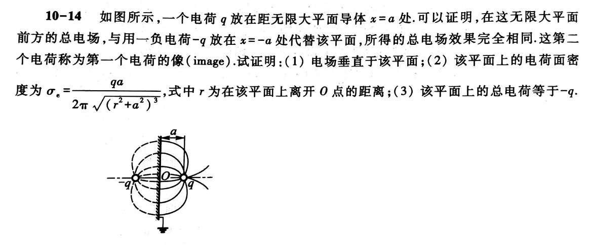
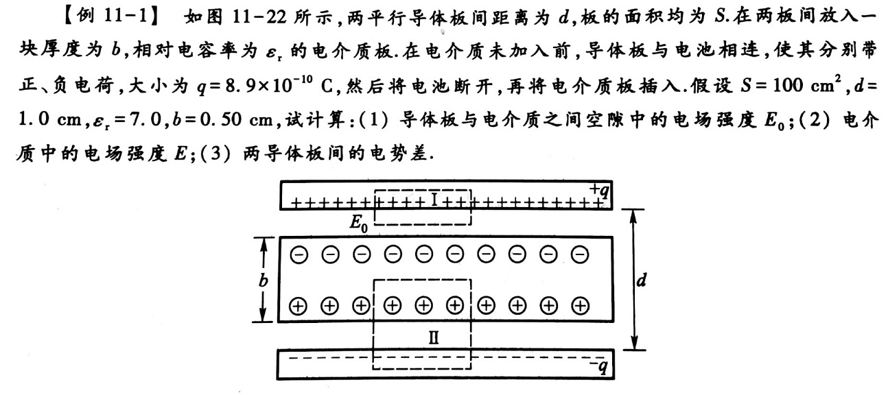
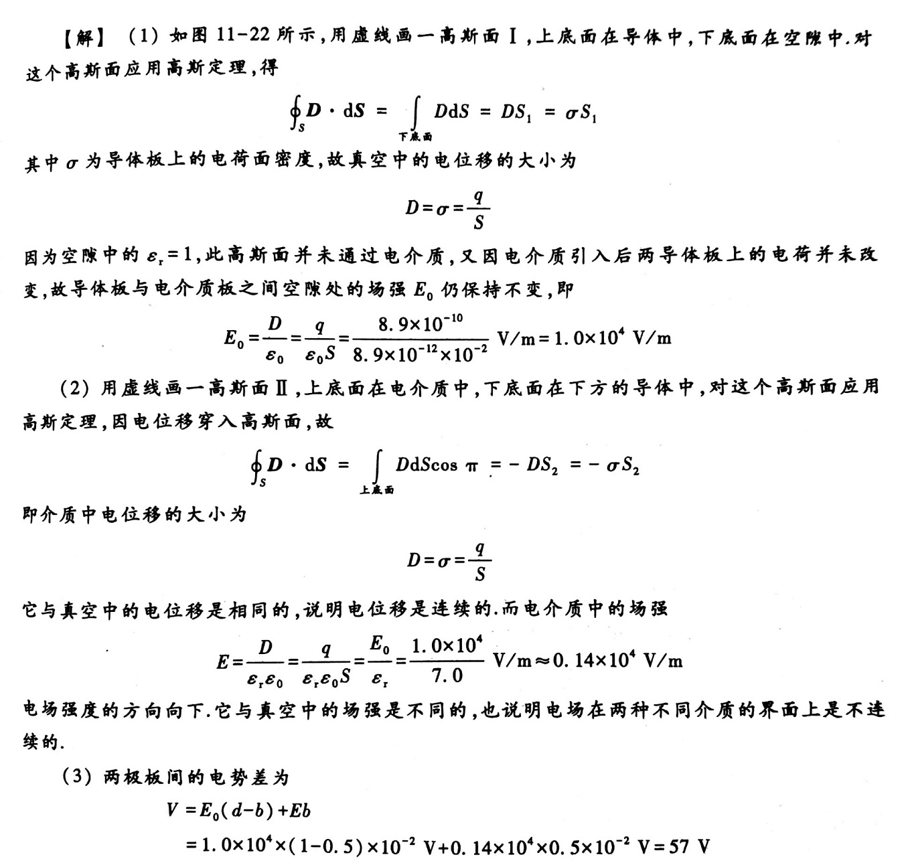
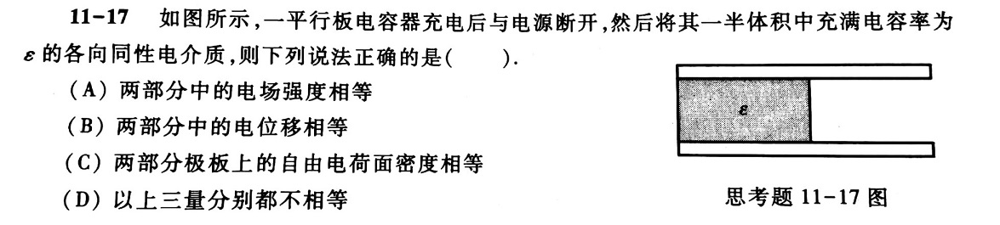
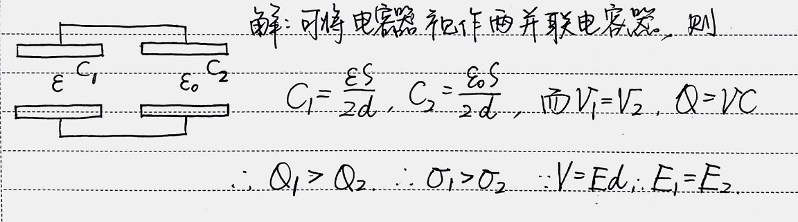
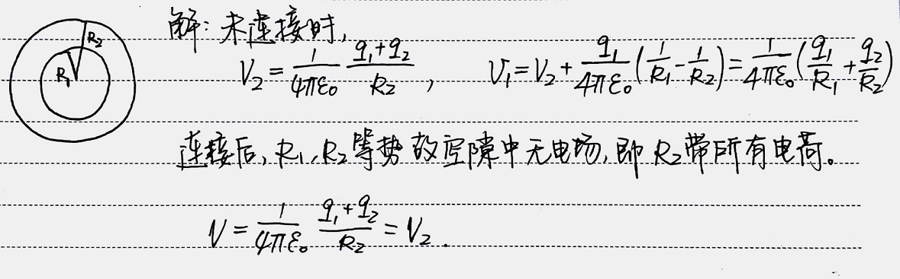
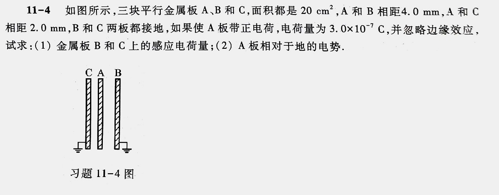
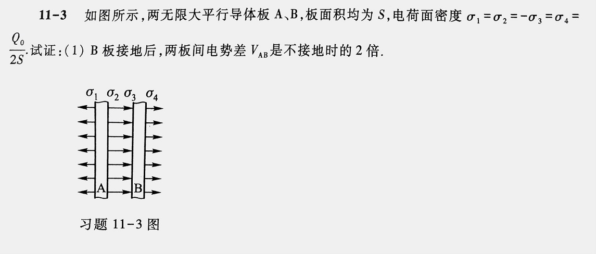
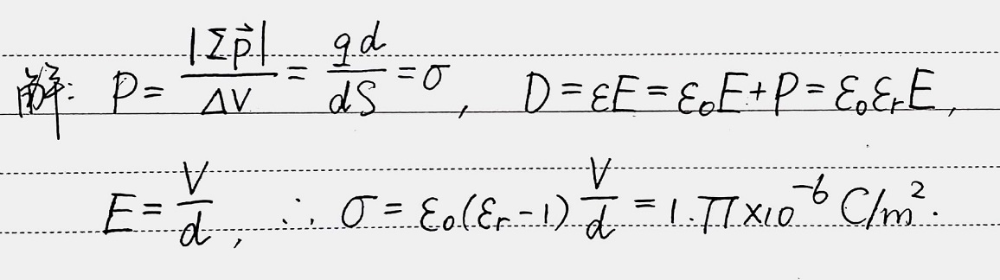

# Electric Field

*1*  
  
->  

 
电像法：空间电场只在有真实电荷的一边相同。

*2*  
  
->  

*3*  
在由一定电荷分布形成的均匀电场 $\vec{E}_ {0}$ 中，与 $\vec{E}_ {0}$ 垂直地放入一个无限大的相对电容率为 $\varepsilon_ {\mathrm{r}}$ 的电介质平板. 试问这时电场 $\vec{E}_ {0}$ 是否变化？电介质内部电场 $\vec{E}$ 与 $\vec{E}_ {0}$ 之比为多少？

*4*  

将一个接地的导体 A 移近一个孤立的导体 B，B 的电势如何变化？  
->  

 
解  
若 B 带正电，则 A 感应出负电荷。  
若以无限远处为电势零点，则讨论一正电荷从附近一点出发运动至无限远的能量情况。  
若以地为电势零点，则将两导体视为电容器，电容 $C$ 减少。  
所的结论一致，即若 B 带正电，则电势减小；带负电则电势增加。  

*5*  
  
->  
  

*6*  
  
->  
  

*7*  
  
->  

 
作包围整个电容器的高斯面，若总电通量非零，则说明有电场线延伸至无限远，与接地条件矛盾。故 B 与 C 总电荷量与 A 等量异号。  
亦可将 A 看作左右两极板，分别与 B，C 构成电容器，分别带等量异号电荷。  
注意，此处情况和串联电容器充电过程不同。串联电容器初始不带电，故满足各极板电荷量绝对值相等。此处不满足此关系。

*8*  
  
->  

 
相同地，B 接地后，两极板电荷量代数和应为 0，四个面从左到右的电荷面密度分别为 $0,\,2\sigma,\,2\sigma,\,0$

*9*  
**11-7** 厚为 $d=2\mathrm{mm}$ 的云母 $(\varepsilon_{\mathrm{r}}=2)$ 作为平行板电容器的电介质. 当电容器充电至电压为 $V=400\mathrm{V}$ 时，求云母的电荷面密度.  
->  
