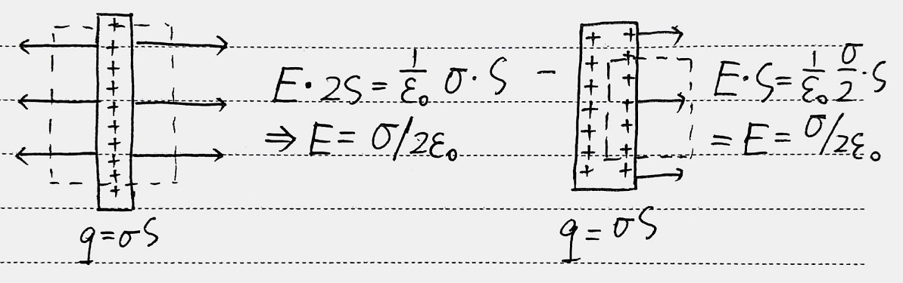
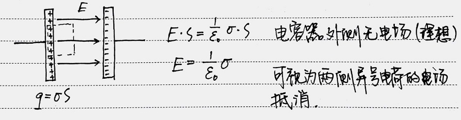
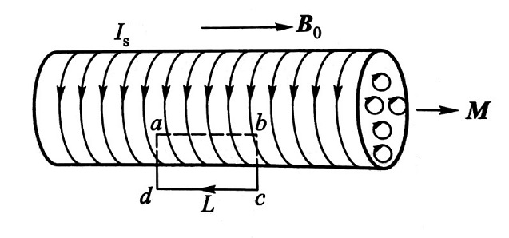

# 电磁学

#### 问题集

* [Electric Field](/notes/electromagnetics/electric-field.html){:target="_blank"}
* [Magnetic Field](/notes/electromagnetics/magnetic-field.html){:target="_blank"}
* [Induction](/notes/electromagnetics/induction.html){:target="_blank"}
* [Electromagnetic Wave](/notes/electromagnetics/em-wave.html){:target="_blank"}

## 静电场

### 无限大平板的电场 

## 电介质

...

### 电荷分布

若将两带电球状导体体 $R_1$、$R_2$ 用导线连接，那么它们的电荷面密度满足

$$
\sigma_1 R_1 = \sigma_2 R_2
$$

### 电极化 

$$
\vec{P}=\frac{\sum{\vec{p}}}{\Delta V}=\chi_e \varepsilon_0 \vec{E}
$$

式中 $\chi_e$ 为介质的**电极化率** *electric susceptibility*

记介质表面束缚电荷面密度 $\sigma'$，则

$$
P=\frac{\vert\vec{P}\vert}{\Delta V}=\frac{\sigma'\Delta SL}{\Delta SL\cos\theta}=\frac{\sigma'}{\cos\theta}
$$

$$
\sigma'=P\cos\theta=\vec{P}\cdot\vec{e}_n
$$

### 电位移 电介质高斯定理

$$
\oint_S \vec{E}\cdot\text{d}\vec{S}=\frac{1}{\varepsilon_0}\left(q+q'\right)
$$

而束缚电荷反号

$$
q'=-\sigma' S=-\oint_S\vec{P}\cdot\text{d}\vec{S}
$$

所以

$$
\vec{D}=\varepsilon_0\vec{E}+\vec{P}
$$

$$
\oint_S \vec{D}\cdot\text{d}\vec{S}=q
$$

### 串联电容器电压分配  

由 $Q=CV$，$Q$ 相等，所以 $V\propto\dfrac{1}{C}$，

$$V_1 C_1 =V_2 C_2$$

### 电容器

#### 电容

$$
C=\frac{\varepsilon S}{d}
$$

#### 电容器能量

$$
W=\frac{1}{2}CV^2
$$

#### 静电场能量密度

$$
w=\frac{W}{V}=\frac{1}{2}\varepsilon E^2=\frac{1}{2}DE
$$

## 恒定磁场

### 电流密度

$$
\vec{J}=qn\vec{v}
$$

$$
I=\int_S \vec{J}\cdot\text{d}\vec{S}
$$

### Biot-Savart Law

$$
\text{d}\vec{B}=\frac{\mu_0}{4\pi}\frac{I\text{d}\vec{l}\times\vec{r}}{r^3}
$$

$$
\vec{B}=\frac{\text{d}\vec{B}}{\text{d}N}=\frac{\mu_0}{4\pi}\frac{q\vec{v}\times\vec{r}}{r^3}
$$

### 安培环路定理
### 洛伦兹力
### 霍尔效应

无论载流子类型，磁场对电流的作用力方向一致，故载流子类型决定了电势差方向

### 安培力

$$
\text{d}\vec{F}=I\text{d}\vec{l}\times\vec{B}
$$

### 磁力做功

$$
A=I\Delta\varPhi_m
$$

### 电矩与磁矩

**电矩**  

$$
\vec{p}=q\vec{l}
$$

由负电荷指向正电荷

$$
\vec{M}=\vec{p}\times\vec{E}
$$

**磁矩**  

$$
\vec{m}=IS\vec{e}_n
$$

符合右手螺旋关系

$$
\vec{M}=\vec{m}\times\vec{B}
$$

### 磁介质

将磁介质等效为一密绕螺线管，单位长度的磁化电流 $\alpha=\lambda_I$  

故等效附加磁矩为 $m=\alpha LS$

所以

$$
M=\frac{m}{\Delta V}=\frac{\alpha LS}{LS}=\alpha
$$

$$
\oint_L \vec{M}\cdot\text{d}\vec{l}=Ml=\alpha l=I'S
$$

$I'$ 为通过该曲面的总磁化电流

### 磁介质安培环路定理

$$
\oint_L \vec{B}\cdot\text{d}\vec{l}=\mu_0\left(I+I'\right)
$$

$$
\oint_L\vec{B}\cdot\text{d}\vec{l}=\mu_0\left(I+\oint_L\vec{M}\cdot\text{d}\vec{l}\right)
$$

$$
\oint_L\left(\frac{\vec{B}}{\mu_0}-\vec{M}\right)\cdot\text{d}\vec{l}=I
$$

$$
\vec{H}=\frac{\vec{B}}{\mu_0}-\vec{M}
$$

$$
\vec{M}= \chi_m\vec{H} 
$$

$$
\begin{aligned}
\vec{B}
&=\mu_0\vec{H}+\mu_0\vec{M}\\
&=\mu_0\vec{H}+\mu_0\chi_m\vec{H}\\
&=\mu\vec{H}
\end{aligned}
$$

## 电磁感应

### 法拉第电磁感应定律

$$
\mathscr{E}=-\frac{\text{d}\varPhi}{\text{d}t}
$$

若讨论的是线圈，则需要考虑匝数  
线圈产生的电动势是各匝线圈电动势之和  

$$
\mathscr{E}=-\frac{\text{d}\varPsi}{\text{d}t}
\qquad
\varPsi=\sum\varPhi
$$

其中通过的电荷

$$
q=\left\vert\int I\text{d}t\right\vert=\left\vert\int \frac{\mathscr{E}}{R}\text{d}t\right\vert=\left\vert\frac{1}{R}\int \text{d}\varPhi\right\vert=\frac{1}{R}\left\vert\Delta\varPhi\right\vert
$$

### 动生电动势

载流子受到洛伦兹力 

$$\vec{F}=q\vec{v}\times\vec{B}$$  

等效非静电场场强 

$$E=\frac{\vec{F}}{q}=\vec{v}\times\vec{B}$$

所以，动生电动势

$$\mathscr{E}=\int_L\left(\vec{v}\times\vec{B}\right)\cdot\text{d}\vec{l}$$

推论：平动动生电动势等效为连接起点与终点的直导线的动生电动势  

### 感生电动势

若磁场变化而回路不运动，

$$
\begin{aligned}
\oint_L\vec{E}\cdot\text{d}\vec{l}
&=\mathscr{E}=-\frac{\text{d}\varPhi}{\text{d}t}\\
&=-\frac{\text{d}}{\text{d}t}\int_S\vec{B}\cdot\text{d}\vec{S}\\
&=-\int_S\frac{\partial\vec{B}}{\partial t}\cdot\text{d}\vec{S}
\end{aligned}
$$

所以

$$\oint_L\vec{E}\cdot\text{d}\vec{l}=-\int_S\frac{\partial\vec{B}}{\partial t}\cdot\text{d}\vec{S}$$

### 自感

毕奥-萨伐尔：$B\propto I$，又 $\varPsi\propto B$，故有

$$\varPsi=LI$$

其中$L$为**自感系数**，单位为 $\text{H}=\Omega\cdot\text{s}$

$$\mathscr{E}_L=-\frac{\text{d}\varPhi}{\text{d}t}=-L\frac{\text{d}I}{\text{d}t}$$

$RL$ 串联暂态过程

$$I=I_0\left(1-\mathrm{e}^{-\frac{t}{\tau}}\right)$$

其中时间常量

$$\tau=\frac{L}{R}$$

### 互感

线圈 2 处由线圈 1 电流变化产生的磁链

$$\varPsi_{21}=M_{21}I_1$$

线圈 1 处由线圈 2 电流变化产生的磁链

$$\varPsi_{12}=M_{12}I_2$$

而

$$M_{21}=M_{12}=M$$

故

$$\mathscr{E}_{21}=-M\frac{\text{d}I_1}{\text{d}t}\,,\qquad\mathscr{E}_{12}=-M\frac{\text{d}I_2}{\text{d}t}$$

### 磁场能量

自感线圈中，

$$W=\frac{1}{2}LI^2$$

磁场能量密度

$$w=\frac{W}{V}=\frac{1}{2}\frac{B^2}{\mu}=\frac{1}{2}BH$$

### 非恒定电流的安培环路定理 位移电流

平行板电容器电路处安培环路定理发生矛盾

由于极板电荷

$$q=\int_S\vec{D}\cdot\vec{S}=\varPhi_D$$

线路中电流

$$I=\frac{\text{d}q}{\text{d}t}=\frac{\text{d}\varPhi_D}{\text{d}t}$$

故定义**位移电流**与**位移电流密度**

$$I_d=\frac{\text{d}\varPhi_D}{\text{d}t}\,,\qquad\vec{J}_d=\frac{\text{d}\vec{D}}{\text{d}t}$$

所以在非恒定情况，安培环路定理为

$$\oint_L\vec{H}\cdot\text{d}\vec{l}=I+\frac{\text{d}\varPhi_D}{\text{d}t}$$

即变化的电场也能激发磁场

## 麦克斯韦方程组

积分形式

$$
\begin{aligned}
&\oint_S\vec{D}\cdot\text{d}\vec{S}=\sum q\\
&\oint_S\vec{B}\cdot\text{d}\vec{S}=0\\
&\oint_L\vec{E}\cdot\text{d}\vec{l}=-\oint_S\frac{\partial\vec{B}}{\partial t}\cdot\text{d}\vec{S}\\
&\oint_L\vec{H}\cdot\text{d}\vec{l}=\oint_S\left(\vec{J}+\frac{\partial\vec{D}}{\partial t}\right)\cdot\text{d}\vec{S}
\end{aligned}
$$

微分形式

$$
\begin{aligned}
&\nabla\cdot\vec{D}=\rho\\
&\nabla\cdot\vec{B}=0\\
&\nabla\times\vec{E}=-\frac{\partial\vec{B}}{\partial t}\\
&\nabla\times\vec{H}=\vec{J}+\frac{\partial\vec{D}}{\partial t}
\end{aligned}
$$

对于各向同性介质，有

$$
\vec{D}=\varepsilon\vec{E}\,,\quad
\vec{B}=\mu\vec{H}\,,\quad
\vec{J}=\sigma\vec{E}
$$

对于带电粒子的运动，

$$\vec{F}=q\left(\vec{E}+\vec{v}\times\vec{B}\right)$$

## 电磁波

### nabla 算符 $\nabla$

$$\nabla=\left(\frac{\partial}{\partial x},\frac{\partial}{\partial y},\frac{\partial}{\partial z}\right)$$

梯度

$$\nabla F=\left(\frac{\partial F}{\partial x},\frac{\partial F}{\partial y},\frac{\partial F}{\partial z}\right)$$

散度

$$\nabla\cdot\vec{F}=\frac{\partial F_x}{\partial x}+\frac{\partial F_y}{\partial y}+\frac{\partial F_z}{\partial z}$$

旋度

$$
\nabla\times\vec{F}=
\begin{vmatrix}
\vec{\text{i}}&\vec{\text{j}}&\vec{\text{k}}\\
& &\\
\dfrac{\partial}{\partial x}&\dfrac{\partial}{\partial y}&\dfrac{\partial}{\partial z}\\
& &\\
F_x&F_y&F_z
\end{vmatrix}
$$

Laplace 算子 $\Delta$

$$
\Delta=\nabla^2=\nabla\cdot\nabla=\left(\frac{\partial^2}{\partial x^2}+\frac{\partial^2}{\partial y^2}+\frac{\partial^2}{\partial z^2}\right)
$$

### 电磁波波动方程

真空中

$$\nabla^2\vec{E}-\varepsilon_0\mu_0\frac{\partial^2\vec{E}}{\partial t^2}=0$$

$$\nabla^2\vec{B}-\varepsilon_0\mu_0\frac{\partial^2\vec{B}}{\partial t^2}=0$$

若电磁波沿$\, x$轴传播，则

$$\frac{\partial^2 E_y}{\partial x^2}=\varepsilon_0\mu_0\frac{\partial^2 E_y}{\partial t^2}\,,\quad\frac{\partial^2 H_z}{\partial x^2}=\varepsilon_0\mu_0\frac{\partial^2 H_z}{\partial t^2}$$

比较平面机械波波动方程有

$$c=\frac{1}{\sqrt{\varepsilon_0\mu_0}}$$

在介质中，

$$u=\frac{1}{\sqrt{\varepsilon\mu}}$$

且满足关系

$$\sqrt{\varepsilon}E=\sqrt{\mu}H$$

### 电磁波能量

$$
\begin{aligned}
w&=w_e+w_m\\
&=\frac{1}{2}\varepsilon E^2+\frac{1}{2}\mu H^2\\
&=\varepsilon E^2=\mu H^2
\end{aligned}
$$

能流密度

$$
\begin{aligned}
S&=wu\\
&=\frac{1}{2}\frac{\varepsilon E^2+\mu H^2}{\sqrt{\varepsilon\mu}}\\
&=\frac{1}{2}\frac{\sqrt{\varepsilon}E\sqrt{\mu}H+\sqrt{\mu}H\sqrt{\varepsilon}E}{\sqrt{\varepsilon\mu}}\\
&=EH
\end{aligned}
$$

即**坡印廷矢量** *Poynting vector*

$$
\vec{S}=\vec{E}\times\vec{H}=\frac{1}{\mu}\;\vec{E}\times\vec{B}
$$

### 电磁振荡

$$
\omega=\frac{1}{\sqrt{LC}}
$$

$$
f=\frac{\omega}{2\pi}=\frac{1}{2\pi\sqrt{LC}}
$$
