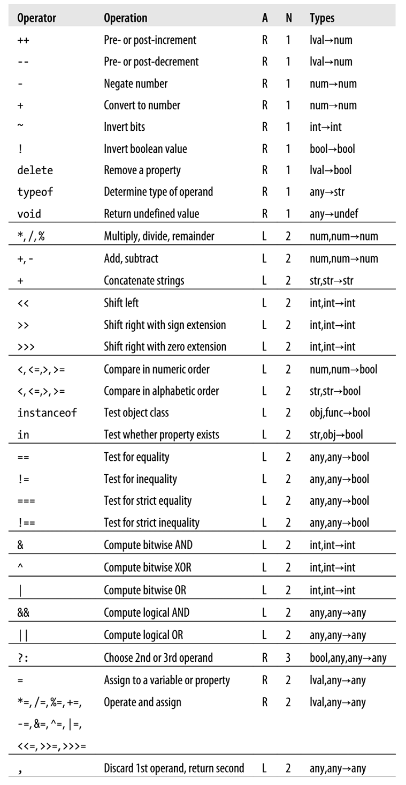

# JavaScript: The Definitive Guide

>*Sixth Edition, Digital*  
*David Flanagan*  
*2011, O'Reilly*  
*2019.3.22 - 4.24 (Ch.1 -Ch.12) 长沙*  

---

#### CONTENTS
* [Lexical Structure](#lexical-structure)
* [Types, Values, and Variables](#types-values-and-variables)
* [Expressions](#expressions)
* [Operators](#operators)
* [Statements](#statements)
* [Objects](#objects)
* [Arrays](#arrays)
* [Functions](#functions)
* [Classes and Modules](#classes-and-modules)
* [RegularExpressions](#regular-expressions)
* [JavaScript Subsets and Extenstions](#javascript-subsets-and-extensions)

---

## Lexical Structure

#### Comment  
```js
// Comments 
/* Multiline
   Comments */
``` 

### Character set

Javascript supports unicode. They can be typed to the code directly or use `\uxxxx`.

JS is case-sensitive.

### Identifiers

```js
var x = 10;
```
The naming rules are very similar to that in C language, but identifiers in JavaScript can also begin with a dollar sign (`$`), besides an underscore (`_`).

#### Reserved Words

  

### Semicolon

Semicolons are optional. JavaScript treat a line break as a semicolon only when it can't parse the code without it. 
```js
var y = x + f
;(a+b).toString() // Defensive semicolon
```
所以，以 `(`、`[`、`/`、`+`、`-` 开头的一行之前一般要加上分号。这个规则有两个例外：
```js
return
true;
// ==> return; true;
```
```js
x
++
y
// ==> x; ++y;
```

## Types, Values, and Variables

Any JavaScript **value** that is not a number, a string, a boolean, a `null` or `undefined` is an **object**, for example, arrays and functions.

JavaScript is **object-oriented**.

JavaScript uses **lexical scoping**. Variables declared inside a function scope are visible only to code inside that function. And variables outside functions are global.

### Numbers

JS并不严格区分整数和浮点数，他们都用64位浮点数来表示，范围和精度分别是约 $\pm1.8\times10^{308}$ 和 $\pm5\times10^{324}$。可以精确表示 $\pm2^{53}$ 内的整数，超出范围可能会导致小数点后的偏差。

整数可以直接用十进制表示，十六进制用 `0x` 开头表示（大小写均可）。  
但是有些版本的 JS 可以用 0 开头表示八进制，有些不支持，所以有时候根本不知道这是八进制还是十进制。严格 ECMAScript 5 禁止使用这种表示法。  

整数部分为 0 的浮点数可以直接以小数点开头。科学计数法用 `E` 表示，和 C 语言一样。

#### Arithmetics
除了加减乘除余，其它运算要用到 `Math` 对象。
```js
Math.pow(x,y)
Math.round(x)
Math.ceil(x)
Math.floor(x)
Math.max(x,y,z)
Math.min(x,y,z)
Math.random()       // 0<=x<1
Math.PI
Math.E
Math.sqrt(x)
Math.pow(x,y)
Math.sin(x)
Math.log(x)         // Natural logarithm
Math.log(x)/Math.LN10
Math.log(x)/Math.LN2
Math.exp(x)
```

如果运算超过了范围，JS不会报错，而是将它们表示为 `Infinity` 或者是 `-Infinity`，被零除或者 `Infinity` 加上一个正数都属于这种情况。但是有趣的是，`0` 和 `-0` 是相等的，但是被它们除分别得到正负的无限，即不相等。若是零被零除，这个未定义的值则会显示为 `NaN`，Not A Number。  
除了直接逻辑判断，还可以用 `IsNaN(x)` 和 `IsFinite()` 来判别。

JS中浮点数是二进制表示的，即可以精确表示 1/2、1/4，但是 0.1 却不行。0.3-0.2 和 0.2-0.1 不一定等于 0.1，甚至它们两个本身都不相等。

### Date and Times
```js
var now = new Date();
var then = new Date(2010,0,1,17,59,59);
var elapsed = now-then; // In milliseconds

now.getFullYear();      // ==>2019
now.getMonth();         // ==>0 zero-based!
now.getDate();          // 0 is Sunday
now.getDay();
now.getHours();
now.toString();
now.toUTCString();
now.toLocaleDateString();
now.toLocaleTimeString();
```

### Text

A string is immutable and ordered, *contained in single or double quotation marks, similar to Python*.

字符串使用无符号 16 位编码，从 0 开始编号。一些特殊的字符会用 17 位，它们的长度算作 2。

转义字符，除了一般的以外，可以用 `\` + 换行表示 newline 字符（ES5）。
```js
"new\
line"
```
若反斜杠跟随的字符不能构成转义字符，那么这个反斜杠会被忽略。

```js
s.length
s.CharAt(x)    
s.substring(x, y)   // [x, y)
s.slice(x, y)       // ==substring
s.slice(-x)         // 最后x个字符
s.indexOf(c)        // 字符从c出现的第一个位置
s.lastIndexOf(c)
s.indexOf(c, x)     // x位之后出现的第一个c
s.split(str)        // Split s at each str
s.replace(c1, c2)
s.toUpperCase()
s[x]                // ECMAScript 5
```
Strings are immutable, therefore all those methods do not alter the value of s.


#### Pattern Matching

JavaScript adopt Perl's syntax for regular expressions. Regex literals are quoted between a pair of slashes (`/`), where the second slash can be followed by some letters, which modify the meaning of the pattern.

```js
var t = "1, 2, 3";
var p = /\d+/gi       // Case-insensitive, all instances
pattern.test(t)     // Boolean
t.search(p)         // 第一次匹配到的p
t.match(p)          // 所有匹配结果的数组
t.replace(p, str)
t.split(p)
```

### Boolean Values

即 `true` 和 `false`。可以用 `toString()` 方法来转换为对应字符串。

与或非运算符为
```js
&&
||
!
```

下列值可以转换为 `false`：
```js
undefined
null
0
-0
NaN
""
```

注意 `if (x !== null)` 和 `if (x)` 是不同的。

### `null` and `undefined`

`null` indicates some kind of abcense of value. It is a special object.

`undefined` is a deeper kind of absence. It is the value of something not exists, and it is returned by a function without an return value. Applying `typeof` on `undefined` will get `undefined`.

`==` consider them equal but `===` does not. `undefined` conveys something unexpected and erroneous. `null` is a better choice to assigning a 'no-value' to a variable.

### The Global Object
JavaScript interpreter creates a new global object and gives it a set of properties:
* global properties like `undefined`, `Infinity`, and `NaN`
* global functions like `isNaN()`, `eval()`
* constructors like `Date()`, `RegExp()`, `Object()`, `Array()`
* global objects like `Math` and `JSON`

This global object can be refered by `this` in the top-level/scope of JavaScript code.

### Wrapper Objects

字符串不是对象，但是我们显然可以调用它的方法和属性。这是因为每次调用时JS解释器都会创建一个临时对象 `new String(str)`，调用其方法然后将其销毁。可以显式创建这样的"wrapper objects"，它们的行为和原值几乎一样，只是类型不同。
```js
var s = new String(str);
var n = new Number(num);
var b = new Boolean(boo);
```

### Primitives and Mutables
Primitive values are **immutable**, including `undefined`, `null`, booleans, numbers and strings, while objects are mutable, includeing arrays and functions.

There is no way to mutate primitive values, and they are compared by value. Objects are different, they are compared by reference, that is, two object are equal only when they refer to the same object.

### Type Conversions


JavaScript is very flexible about types.
```js
10 + " objects" // => "10 objects"
'7' * '4'       // => 28
1 - 'x'         // => NaN
```

When using `==` operator, type conversion is performed, while `===` does not:
```js
null == undefined
"0" == 0
0 == false
"0" == false
```

可以显式类型转换：
```js
Number("10")
String(false)
Boolean(1)
Object(3)
```

也可进行隐式转换：
```js
x + ""
+x
!!x
```

从数到字符串的转换是在十进制下的。而可以加入参数`toString(x)`，转换得到x进制（2至36）的字符串（无前缀）。  
十进制数还有以下操作：
```js
n.toFixed(x);       // 固定位小数
n.toExponential(x); // 固定位小数，科学计数法
n.toPrecision(x);   // 固定位有效数字，可能产生科学计数法
```

Parsing string into numbers:
```js
parseInt('3 objects');  // => 3
parseFloat(' 1.72 x');  // => 1.72
```
These two functions ignores leading whitespaces. Illegal leading characters like '.' and '$' will produce a `NaN`. Leading `0x` indicates hexademical and the number is converted into 10-base.

`parseInt()` accepts an optional second argument specifying the radix of the number to be parsed.

#### Object to Primitive Conversion

所有从对象到布尔值的转换都得到`true`，哪怕是`new Boolean(false)`。

所有的对象都有两种转换方法：

`toString()`:
```js
({x:1, y:2}).toString()             // => "[object Object]"
[1,2,3].toString()                  // => "1,2,3" 
(function(x) { f(x); }).toString()  // => "function(x) {\n    f(x);\n}" 
/\d/i.toString()                    // => "/\\d/g" 
new Date(2010,0,1).toString()       // => "Fri Jan 01 2010 00:00:00 GMT-0800 (PST)"
```

`valueOf()`:
```js
new Date(2010, 0, 1).valueOf()      // => 1262332800000 (ms since 1970/1/1)
```

转换为字符串时，先调用 `toString()`，如果失败则调用 `valurOf()` 并转为字符串，如果仍失败则 `TypeError`。  
转换为数则是将两个方法的顺序调换。

`+`, `==`, `!=` and the relational operators are the ones that perform object-to-primitive conversions, while others convert more explicitly to a special type.

### Varible Delcaration

```js
var i;
var j, k;
var p=0, q=0;
```
如果在声明时不给出初值，则这个变量为 `undefined`。

也可在`for`循环当中声明变量：
```js
for(var i=0, j=1; i<10; i++) console.log(i);
```

重复的变量声明将被视为普通的赋值语句。

In strict ECMAScript 5, it is illigal to assign a value to an undelared variable, but you can get away with it by not using strict ES5. In this case, the interpreter will create this variable as a property of the global object.

作为 global object 属性的变量是可删除的，而普通变量不可删除。
```js
fakevar = 0；
delete fakevar;
this.fakevar = 1;
delete this.fakevar;
```

### Variable Scope

全局变量可以与局部变量重名，在局部变量作用域内，同名全局变量相当于被隐藏。

不同于 C 的是，JS 没有所谓的 ‘block scope’，即一对花括号之间的范围作为一个作用域。在 JS 中，只有函数能作为局部作用域。一个函数当中声明的变量的作用域就是这个函数。  
这样就产生了一个奇怪的特性：在函数中声明一个变量可以在声明之前调用，返回的是 `undefined` 而不会报错。

## Expressions

### Primary Expressions

* Constants: `1.2`, `"hello"`, `/\d+/g`
* Some reserved words: `true`, `false`, `null`, `this`
* Variables: `i`, `undefined`

### Initializers

* Array initializers:  
Empty array `[]`  
Expressions `[1+2, 3+4]`  
With `undefined` as entries `[1,,,,5]` == `[1,,,,5,]`

* Object initializers:  
`{x:1, y:2}`  
The value may be any expression, and it can be nested.  
Property names can be identifiers or strings. 

### Property Access Expressions

`p.x` In this case, the property name must be a legal identifier.

`p["y"]` In this case, the property name may be a string. If the value is not an object, it is converted into one.

### Function Definition
### Invocation
### Object Creation

`new Point(1, 1.4)`  

If no argument is passed to the constructor, the parentheses can be omitted.  
`new Date`

## Operators

In this table, 'A' stands for associativity, which can be L (left-to-right) or R (right-to-left). 'N' specifies the numver of operands. The table is orgaized by operator precedence. 水平分割线之前的运算符优先级高于之后的。



If the operand is not one that the operator expects, it will be converted into one.

Left-to-right associativity:  
`w = x - y - z` $\Longleftrightarrow$ `w = (x - y) - z`   
Right-to-left associativity:  
`w = x = y = z` $\Longleftrightarrow$ `w = (x = (y = z))`  
`a?b:c?d:e?f:g` $\Longleftrightarrow$ `a?b:(c?d:(e?f:g))`

#### Binary `+` Operator
If either of the operands is a string or an object that converts to a string, `+` performs concatenation.
```js
"1" + 2     // => "12"
1 + {}      // => "1[object Object]"
true + true // => 2
```

#### Unary `+`, `-` Operator
`+` 将操作数转换为数类型。  
`-` 先转换为数，再变号。

#### Identical and Equality

The identical operator `===` performs following rules:
* If one or both values are `NaN`, they are not identical. `NaN` is the only value of `x` for `x !== x` to be true.
* `0` and `-0` are identical.

The equality operator `==` converts the type of its operands, if necessary:  
* If the values are identical, they are equal.
* `null` and `undefined` are equal.
* `1` and `'1'` are equal.

#### Comparison Operator
```js
"11" < "3"  
"11" > 3    // '11' is converted into number
```
如果两边有一个是（或被转换为）`NaN`，那么总是返回`false`

#### The `in` Operator
```js
var p = {x:1, y:1};
"x" in p             // => true: p has property named "x" 
"z" in p             // => false: p has no "z" property. 
"toString" in p      // => true: p inherits toString method

var data = [7,8];    // An array with elements 0 and 1
"0" in data          // => true: array has an element "0" 
1 in data            // => true: numbers are converted to strings 
3 in data            // => false: no element 3
```

#### The `instanceof` Operator
若左边的对象是右边类名的实例则返回真。因为JS中类名就是构造函数名，所以右操作数应为一函数名，否则 it throws `TypeError`.

#### Logical Operators

逻辑运算符 `&&`、`||` 和 `!` 并不要求操作数是布尔值，若不是，则先转换为布尔值。

For AND (`&&`), if the left operand if falsy, the right operand WON'T be evaluated.
```js
if (a == b) foo();
(a == b) && foo();  // They do the same thing!
```

The same for OR (`||`), the second operand is neglected when the first one is truthy.
```js
var m = m1 || m2 || 100     // Choose the first truthy one.
```

#### Assignment with Operation

`+=`, `-=`, `*=`, `/=`, `%=`, `<<=`, `>>=`, `>>>=`, `&=`, `|=`, `^=`.

#### Evaluation

`eval()` interprets JavaScript source code in string. Dynamic evaluation is powerful but almost never necessary in practice. Think carefully before using it.

It returns the value of the last expression or statement. If the last expression or statement has no value, it returns `undefined`. If the string throws an exception, `eval()` throws `SyntaxError`.

`eval()` 的一个很重要的特性就是它能获取变量的值，它对变量的操作和直接操作时一样的。

Only the variable declaration is hoisted -- the variable initialization remains where it is placed.

#### The `typeof` Operator
`typeof` returns a string such as "undefined", "object", "boolean", "string", "number", "function".

Note that `typeof(null)` returns "object", and `typeof(NaN)` returns "number".

#### The `delete` Operator
`delete`可被用于删除对象或者是数组的成员。注意使用`var`和`function`所定义的量是不可删除的。

#### The `void` Operator
`void` evaluates the operand and then discard the value and return `undefined`, so it only make sense when the operand has side effects.

#### The Comma Operator
`,` evaluates the left operand, then discards it, returns the value of the right operand. So it make sense only when the left operand has side effects.

The comma operator is commonly used in `for` loop
```js
for(var i=0, j=10; i < j; i++, j--)
```

## Statements

Expressions are *evaluated* to produce a value, while statements ar *executed* to make something happen.

#### Expression Statements
最常用的就是赋值语句，还有函数调用和自增自减。

#### Compound and Empty Statements
Compound statements are used to execute multiple statements where JavaScript expects a single statement. The empty statement is the opposite, it is a single semicolon and does nothing. It is commonly used in loops；
```js
for (i=0; i<a.length; a[i++]=0);
```

#### Declaration
`var` and `function` define identifiers.   
使用 `var` 声明变量时可以用表达式给出初值。  
函数定义可以不给出函数名，而将这个函数赋值给一个变量或者作为参数传入另一个函数。

### Conditionals

#### `if`
注意：
```js
if (<expression>)
    if (<expression>)
        <statement>;
else
    <statement>;
```
这样的缩进方式是错误的。JS 将会把 `else` 语句归为内层的 `if` 语句。

#### `switch`
```js
switch(<expression>)
{
    case 
}
```
各个 `case` 子句中的比较是以 `===` 作为标准的。因为遇到 `break` 时整个语句被跳出，所以并不知道哪些 `case` 会被比较，故比较表达式最好不要引起 side effect。如果没有 `break` 语句，则在执行完匹配到的子块后会继续比较下一情况。

### Loops

#### `while`
```js
while (<expression>)
    <statement>
```
#### `do` / `while`
```js
do
    <statement>
while(<expression>);
```
#### `for`
```js
for(<initialize>; <test>; <increment>)
    statement
```
等价于
```js
<initialize>;
while(test)
{
    <statement>
    <increment>;
}
```
同样地，`for(;;)`就相当于`while(true)`。

#### `for` / `in`

```js
for(<variable> in <object>)
    <statement>
```

此处循环变量遍历的是对象中属性的名称，形式为字符串。

既然每次循环都将循环变量赋值，可以使用 `for(a[i++] in obj);` 来将对象中的每一个属性名复制到数组 `a` 中。

The `for`/`in` loop does not actually enumerate all properties of an object, only the enumerable properties. In practice, the enumeration order is the order in which they were defined. However, this rule may be altered by using some techniques.

### Jumps

#### Labeled Statements

```js
<identifier>: <statement>
```
Any statement can be labeled, though it is only helpful to label statements that have bodies, such as loops, conditionals, and compound statements. Labels are used to specify the destination layer of `break` and `continue`.

标签和变量所使用的命名空间不同，所以它可以和变量或者函数重名。这个标签的作用域只在于被标签的语句之内，所以只要两个标签不嵌套，它们也可以重名。

#### `break`

```js
break <labelname>;
```

This statement can even be a statement block grouped within curly braces for the sole purpose of naming the block with a label. When `labelname` is omitted, the program will break out to the nearest layer of enclosing loop or switch.

#### `continue`

Similar to `break`:
```js
continue <labelname>;
```

* `while` 和 `do`/`while` 循环中，将直接跳至循环条件。
* `for` 循环中，将执行`<increment>`，然后测试循环条件。
* `for`/`in` 循环中，直接将下一个属性名赋值给循环变量（如果存在的话）。

#### `return`
若函数中没有 `return` 或者 `return` 后面没有值，则函数返回的是 `undefined`。

#### `throw`
```js
throw <expression>;
```
`<expression>` may evaluate to a value of any type. Or the error classes that the JavaScript interpreter uses. An error object has a `name` property that specify the type of this error, and a `message` property that holds the string passed to the constructor.

```js
if (x<0) throw new Error("x must be positive.");
```

#### `try` / `catch` / `finally`
```js
try
{
    statement
}
catch (e)
{
    statement
}
finally
{
    statement
}
```
若 `try` 块中出错，则跳转至最近的 `catch`，最后执行 `finally`。`catch` 和 `finally` 必须要有一个，否则 `try` 出错。注意就算只包含一个语句，这三个语句块的花括号也不能省略。

When an exception is caught, the value associated with the exception is assigned to the parameter following `catch`. Unlike regular variables, this identifier is only defined within the `catch` block.

`finally` block is always executed, whether the exception is caught or not, whether the `try` block is exited normally or because of a `break`, `continue` or `return`.

### Miscellaneous Statements

#### `with`
```js
with (<object>)
    <statement>
```
`with` 用于简化访问同一对象不同属性的代码。
```js
with (point)
{
    x = 1;
    y = 2;
    z = 0;
}
```

如果其中一语句出现对非此对象属性的变量名的操作，则这一句的效果和在 `with` 外执行一样。

The `with` statement is forbidden in strict mode and should be considered deprecated in non-strict mode. It is likely to run more slowly than the equivalent code written without `with` statement.

#### `debugger`
`debugger` 相当于断点。执行到此语句的时候代码停止执行，以便检查调用栈。

#### `"use strict"`
这是一个字符串，但被当作语句使用。
```js
"use strict";
```
当然双引号可以用单引号代替。

`"use strict"`只出现在脚本、函数或者`eval()`代码参数的开头部分，即在真正的操作语句之前。这代表相应的代码块使用严格模式。The strict mode of ECMAScript 5 is a restricted subset of the language that fixes a few important language deficiencies and provide stronger error checking and increased security.

In strict mode:
* 禁用 `with`。
对未定义的变量、函数、函数参量、`catch` 参量或 global object 的属性赋值，将抛出 `ReferenceError` 异常。
* 直接作为函数调用的函数中，`this` 的值为 `undefined`。（非严格模式中，这个值将是 global object。）
* 若通过 `call()` 和 `apply()` 调用函数，`this` 值将为 `call()` 或 `apply()` 的第一参数。
* 对只读属性赋值和不可扩展的对象添加成员将抛出 `TypeError`。（非严格模式不会报错。）
* 不可在 `eval()` 中定义在 `eval()` 外的作用域的变量或函数。在其中定义的作用域只在 `eval()` 之内。
* 一个函数中的 `arguments` 对象是参数的静态副本。（非严格模式中，这个数组中的元素和函数参数指向同一个量。）
* 不允许 `delete` 不可删除的量或者 *unconfigurable* 的对象属性。（非严格模式中不会进行删除，只会返回 `false`。）
* 不允许定义有重名属性的对象或者有重名参数的函数。
* 不允许八进制数，即以 `0` 而非 `0x`/`0X` 开头的数。
* `eval` 和 `arguments` 相当于关键字，不允许以任何形式改变其值，如赋值，声明，作为函数名，函数参量或者作为 `catch` 参数。
* 限制对调用栈的检测，函数的 `arguments.caller`、`arguments.callee`、`caller` 和 `arguments` 属性将会抛出 `TypeError` 异常。

## Objects

An object is a composite value that maps properties (strings) to values.

The properties can usually be added or deleted.

任何不是字符串、数、布尔量、`null` 或者 `undefined` 的值都是对象。And strings, numbers and booleans behave like immutable objects.

Objects are manipulated by reference. In `var y = x`, `x` and `y` refer to the same object. 

Each property has *property attributes*:
* The *writable* attribute specifies whether the value can be set.
* The *enumerable* attribure specifies whether the property name is returned by a `for`/`in` loop.
* The *configurable* attribure specifies whether the property can be deleted and whether its attributes can be altered.

Every object has three associated *object attributes*:

* *prototype*
* *class*
* *extensible*

### Prototypes

Every object has its *prototype* , or very few of them `null`. All object created by object literal share the common prototype called `Object.prototype`. `new Object()` or `{}` also share this prototype. Similarly, `new Array()` or `[]` has the prototype `Array.prototype`. This link a series of objects to form a *prototype chain*.

`Object.prototype` itself doesn't have a prototype, inheriting no properties.


### Creating Objects
```js
var point={x:0, y:0};
```

每次执行到这个语句时，都会创建一个全新的对象。在 ES5 中，即使属性名是保留字，也不必加引号，但有一些 ES3 解释器要求有引号。最后一个属性后的逗号可有可无，但是 IE 中不允许出现这个逗号。

`new` 与构造函数创建对象：
```js
var o = new Object();   // == {}
var a = new Array();    // == []
var d = new Date();     // Current time
```

`Object.create()` 创建对象：
第一个参数是对象原型，第二个可选参数是新对象的参数。
```js
var o = Object.create({x:1, y:2}); // o继承x和y
var n = Object.create(null);
```

### Object as Associative Arrays
```js
object["property"]
```
这种访问方式非常像数组，事实上中括号内的内容是先转换为字符串。也就是说可以在中括号内进行运算或者类型转换。

### Inheritance

从原型对象继承的属性保留其值。事实上，继承所得的属性还是归原型所有。若改变原型，子对象的继承属性也会改变。

对某对象的属性赋值时：
* 若对象已有非继承的该属性，则改变它的值。
* 若对象无该属性，则创建这个属性并赋值。
* 若对象属性是继承而来，that inherited property is now hidden by the newly created own property with the same name.

### Property Access Errors

It is not an error to query a property that does not exist. That will return `undefined`. But it will raise a `TypeError` to attempt to query a property of an *object that does not exist*.

Attempts to set read-only properties or add a property to a non-*existensible* object, curiously, however, fails silently, but a `TypeError` will be thrown in strict mode.

An attempt to set a property `p` of an object `o` fails when:
*  `o` *owns* or *inherits* the read-only property `p`,
*  `o` does not own `p`; `o` does not inherit `p` with a setter method; o is not *extensible*.

### Deleting Properties

The `delete` operator only deletes own properties, not inherited ones.

`delete` 删除成功或者删除不存在的属性的时候返回 `true`。但是删除 non-*configurable* 时会失败并且返回 `false`。In strict mode, it raises a `SyntaxError`.

### Testing Properties

有几种方法来查看对象的某属性是否存在。

```js
"x" in o    // => true or false

o.hasOwnProperty("x")   
// must be an own property
// 注意，修改继承属性会创建同名属性，覆盖原继承属性，
// 从而hasOwnProperty返回true。

o.propertyIsEnumerable("x")

o.x !== undefined
// 和 in 的区别在于是否能判别是存在的属性而被赋值为 undefined。
// 注意是严格不等号。
```

### Enumerating Properties

Built-in methods that objects inherit are not enumerable, but properties that the codes add are, unless made nonenumerable manually.

在ES5中，还有两个函数返回对象的属性名。  
`Object.keys()` 接受一个对象作为参数，返回这个对象中可遍历的属性名。  
`Object.getOwnPropertyNames()` 则返回对象所有的自有属性。

### Property Getters and Setters

The property value may be replaced by one or two methods, known as a *getter* and a *setter*. These properties are called *accessor properties* to distinguish them from normal *data properties*.

The difinition of these two methods are like functions:
```js
var p = {
    x:1,
    y:1,
    get r() {return Math.sqrt(this.x*this.x + this.y*this.y)},
    set r(value) {
        this.x = ...
        this.y = ...
    }
}


p.r     // => 1.414...
p.r = 2
```

The existence of *setter* and *getter* determines the writability and readablity of this property.

### Property Attributes

In ECMAScript 3, all properties are writeble, enumerable and configureable, and there is no way to change them. ESMCScript 5 allows querying and setting them.

The four attributes of a data property are
* *value*,
* *writable*,
* *enumerable*,
* *configurable*.

The four attributes for an accessor property are
* *get*,
* *set*,
* *enumerable*,
* *configurable*.

`Object.getOwnPropertyDescriptor()` returns an object containing these attributes.
```js
Object.getOwnPropertyDescriptor(p, "x");
// => {value:1 ,writable:true ...}
Object.getOwnPropertyDescriptor(p, "r");
// => {get: <function>, set: <function>, ...}
```

It returns `undefined` on inherited properties or properties that does not exist. To query the attributes of inherited properties, you must traverse the protopype chain using `Object.getPrototypeOf()`.

To modify the attributes, use `Object.defineProperty()` or `Object.defineProperties()`:
```js
Object.defineProperty(o, "x", { value: 1,
                                writable: false});
Object.defineProperties(o, {
    x:{value:1, writable:true},
    y:{value:2, configurable:false}
})
```
Both the functions returns the processed object.

The property desciptor you pass to these functions does not have to include all four attributes. If you are creating a new property, then omitted attributes are taken to be `false` or `undefined`. If you are modifying an existing property, then the omitted remain unchanged.

使用 `Object.create()` 创建新对象时，第二个可选参数的声明 `Object.defineProperties()` 中的。

### Object Attributes

Every object has three associated attributes:
* *prototype*,
* *class*,
* *extensible*.

#### The `prototype` Attribute

The `prototype` of an object is set when the object is created. In ECMAScript 5, passing the object into `Object.getPrototypeOf()` queries its prototype. To determine whether an object is the prototype of another, use `p.IsPrototypeOf(o)`.

#### The `class` Attribute

The default `toString()` method (inherited from `Object.prototype`) returns a string of the from `[object class]`. To invoke the right version, we usually do
```js
Object.protptype.toString.call(o).slice(8, -1)
```
This works for any value except `null` and `undefined`.

#### The `extensible` Attribute

ECMASctipt 5 defines functions to query and setting extensibility of an object. Pass an object to `Object.isExtensible()` to determine whether it is extensible, to `Object.preventExtensions()` to make it nonextensible. Note that making it nonextensible only affect the object itself, and it is irreverseable..

`Object.seal()` not only make the object nonextensible, but also make all properties nonconfigurable, that is, no properties can be added, deleted or configured. `Object.isSealed()` determines whether it is sealed.

`Object.freeze()` locks the object down more tightly. It makes the object nonexistensible, and all its properties nonconfigurable and read-only. And `Object.isFrozen()` is its indicator function.

`Object.preventExtensions()`, `Object.seal()` and `Object.freeze()` only affect the object itself, not its prototypes. Also, they return the modified object.

### Serializing Objects

ECMAScript 5 provides conversions between JSON and strings. `JSON.stringify()` returns the corresponding string of its JSON parameter. And `JSON.parse()` parses the JSON parameter into a string.

### Object Methods

`toString()` method returns a string in the form of  `[object <class>]`. But it is not much useful, so there are some customized versions such as `Array.toString()`, `Date.toString()` and `Function.toString()`.

`toLocaleString()` method returns a localized string.

`valueOf()` is another not-so-interesting method.


## Arrays

An array is an ordered collection of values. Each value is called a *element* and has its position called *index*. JavaScript arrays are untyped, and different elements of an array may be of different types. The indexes use 32-bit integer and are zero-based (highest $4294967294 = 2^{32}$).

### Creating Arrays

Array literal:
```js
var empty = [];
var primes = [empty, true, 1.1, Math.PI+1, ];
```
Array constuctor:
```js
var a = new Array();
var a = new Array(10);
var a = new Array(1 ,2, 3, true, "this");
```
The only patameter for `Array()` specifies the length. If there is more than one parameters, they are the array elements.

### Arrays as Objects

JavaScript arrays are a special type of object. When accessing elements like `a[1]`, the index becomes a string `"1"`. You can index the array with non-index numbers like real number or even strings, and they are treated like normal object properties. There is no "Out Of Bound" error, and when accessing an nonexistent property, you simply get `undefined`. What is special about arrays is that they automatically update `length` property for you.

### Sparse Array

A sparse array is one in which the elements do not have contiguous indexes starting at 0. If the array is sparse, the `length` property is larger than all its indexes.

```js
var a = [];
a[1000] = 0;
```

注意，稀疏数组和普通数组的区别在于，稀疏数组中有不存在的下标，而普通数组未被赋值的地方只是 `undefined` 而已。

像这样 `var a = [,,,]` 定义的数组并不是稀疏的，只是它的值都是 `undefined` 而已。

可以使用 `delete` 删除一些元素使得一个普通数组变为稀疏数组。

### Array Length

In dense arrays, `length` is one more than the highest index. In sparse arrays, it is larger than all indexes.

When inserting an element whose index `i` is beyond current length of an array, its `length` will automatically increase to `i+1`. If `length` is set to a smaller value, then the array is cut off and the values higher than current length will be lost.

### Iterating Arrays

使用 `for` 循环遍历下标：
```js
for (var i = 0; i<a.length; i++)
```

若要跳过不存在和未定义的元素则需要加上
```js
if (a[i] === undefined) continue;
```

若要跳过不存在的下标
```js
if (!(i in a)) continue;
```

还可以使用 `for/in` 循环，注意这里的循环变量是字符串。
```js
for (var i in a)
```

由于数组是一个对象，若它有其它自定义的属性，则在使用 `for/in` 循环时一般是按照创建顺序来遍历，Implementations differ in how they handle this case, so if iteration matters for your algorithm it is best to use a regular `for` loop instead of `for/in`

### Multidimentional Arrays

JavaScript does not support true multdimentional arrays but you can approximate them with arrays of arrays.
```js
var table = new Array(10);
for (var i = 0; i < table.length; i++)
    table[i] = new Array(10);
```

### Array Methods

**ECMAScript 3**:

#### `join()` and `split()`
`join()` 方法接受一个字符串参数，返回数组对应的字符串，每个元素之间用这个字符串分隔符分开。参数默认是一个英文逗号。
```js
a.join()    // => "1,2,3"
a.join("")    // => "123"
```
`split()` 则和 `join()` 相反，which creates an array by breaking a string into pieces.

这两个方法不会改变原数组。

#### `reverse()`
`reverse()` reverses the order of elements in an array *in place*, 也就是说它将原数组逆序。同时它也会返回改变后的数组。

#### `sort()`
`sort()` sorts the elements of the array *in place* and returns the sorted array. 默认情况下按照 Unicode 顺序排列。

若需要其他顺序，则需要一个比较函数作为参数。若左参数在前则返回负值，若两参数等价则返回 0，若右参数在前则返回正值。
```js
a.sort(function(a, b){ return a-b; });
```

#### `concat()`
`concat()` method creates and returns a new array that contains the elements of the original array and its parameters.
```js
var a1 = a.concat(4, 5);            // => [1,2,3,4,5]
var a2 = a.concat([4, 5]);          // => [1,2,3,4,5]
var a3 = a.concat([4,5], [6,7]);    // => [1,2,3,4,5,6,7]
var a4 = a.concat([4, [5,6]]);      // => [1,2,3,4,[5,6]]
```

#### `slice()`
A *slice* is another name of a *subarray*. 即 `a.slice(m,n)` 返回位置满足 $m\le i<n$ 的子数组。这里的位置若为负数，则是指倒数的位置。若第二个参数为空，则表示到数组结束。（参考 Python）

#### `splice()`
`splice()` modifies the array on which it is invoked. 它删除或者插入数组元素，而且数组的其他元素会自动调整以保持连续。第一个参数是删除/插入操作的起始位，第二个参数可选，是从此开始删除的位数，再之后的参数也可选，是在此插入的元素。若省略删除位数，则后面的元素均被截去。最终 `splice()` 返回被删除的子数组。
```js
var a = [1,2,3,4,5];
a.splice(4);        // => [5,6,7,8], a=[1,2,3,4]
a.splice(1,2);      // => [2,3], a=[1,4]
a.splice(2,0,3,4);  // => [], a=[1,4,3,4]
```

#### `push()` and `pop()`
`push()` 方法将所有的参数压入数组末尾，返回数组的新长度。参数保持原序。`pop()` 删除并返回数组末尾元素。

#### `unshift()` and `shift()`
`unshift()` 方法将所有的参数压入数组起始，返回数组的新长度。参数保持原序。`shift()` 删除并返回数组起始元素。

#### `toString()` and `toLocaleString()`
`toString()` 将数组转为字符串，注意它将忽略所有的定界符，如引号和方括号。
```js
[1,[2,'c']].toString()  // => '1,2,c'
```

**ECMAScript 5**:

这几个方法的第一个参数大多都是一个函数，执行方法时会对每一个数组元素执行这个函数（稀疏数组中未定义的元素除外）。这个函数有三个参数，分别是数组元素的值，下标和数组名。一般来讲后两个参数都会被省略。

#### `forEach()`
`forEach()` 就接受上述形式的函数，并将其作用于每一个元素。
```js
var data = [1,2,3,4,5];
var sum = 0;
data.forEach(function(value){ sum += value; });
// sum => 15

data.forEach(function(value, index, a){ a[index] = value + 1; });
//data => [2,3,4,5,6]
```

注意 `forEach()` 并不提供中断的方法。如果需要中止遍历，则需要在中止处抛出异常，并将整个 `forEach()` 放到 `try` 语句内。


#### `map()`
顾名思义，这个函数就是做一个映射：返回一个新数组，其中的元素按顺序是原数组元素通过函数映射的结果。如果原数组是稀疏的，那么返回的数组也会有相同的长度和相同的缺失项。

#### `filter()`
类似地，`filter()` 也接受这么一个函数，这个函数返回一个布尔值，若返回的是 `false`，则对应的元素在返回的新数组中将被滤去（原数组不变）。Note that `filter()` skips the missing elements in sparse array, and that its return value is always dense.

To close the gaps in a sparse array,
```js
var dense = sparse.filter(function(){ return true; });
```

#### `every()` and `some()`
这两个方法就像全称量词 $\forall$ 和存在量词 $\exists$。`every()` 只在数组中所有元素都使得其参数函数返回 `true` 时返回 `true`。`some()` 则在至少有一个元素使得函数返回 `true` 时返回 `false`。注意 `every()` 在遇到第一个产生 `false` 的元素时就退出返回 `false`，`some()` 在遇到第一个产生 `true` 的元素时就退出返回 `true`。

#### `reduce()`, `reduceRight()`
这两个函数将数组元素全部作用于一个二元算符，即成为一个连算符。区别只在于 `reduce()` 从低位到高位遍历，而 `reduceRight()` 相反。这个参数函数有些不同，前面的“值”和可选的“下标”，“数组名”移到了第二、三、四位，而 the first argument is the accumulated result of the reduction so far. 如果加上 `reduce()`/`reduceRight()` 的第二个参数，则相当于给连算符序列之前再加上一项。

```js
var sum = a.reduce(function(x,y){ return x+y; }, 0)
```
相当于计算 $\sum_{n=-1}^{\mathrm{UB}}a_n$，其中 $a_{-1}=0$。

```js
var prod = a.reduceRight(function(x,y){ return x*y; })
```
相当于计算 $\prod_{n=\mathrm{UB}}^{0}a_n$。

```js
var max = a.reduce(function(x,y){ return (x>y)?x:y; })
```
相当于计算 $\max a_n$。

#### `indexOf()` and `lastIndexOf()`
显然，这分别是从低位和从高位开始的匹配函数。这两个方法则不接受函数参数，而第一个参数是要匹配的模式，第二个参数可选，是搜寻的起始位（可以用负数表示倒数）。返回值是第一次匹配到的位置，若未找到则返回 -1。

要寻找所有匹配的元素下标，并放入一个数组，可以
```js
function findall(a, x)
{
    var results = [],
        len = a.length,
        pos = 0;
    
    while(pos<len)
    {
        pos = a.indexOf(x, pos);
        if (pos === -1) break;
        results.push(pos)
        pos++;
    }
    return result;
}
```

### Array-Like Objects
只要一个对象的属性有和数组下标一样的名称，还有 `length` 标注其长度，则它们也可以做一些类似的事情，甚至可以调用对应的数组原型方法。

```js
var a = {"0":"a", "1":"b", "2":"c", length:3};
Array.prototype.join.call(a, "+")  // => "a+b+c"
```

### String As Arrays
字符串可以当作一种只读数组来用。一个广泛应用的例子就是 `str.charAt(i)` 常写作 `str[i]`。甚至可以调用一些方法
```js
s = "JavaScript";
Array.prototype.join.call(s, "");
// => "J a v a S c r i p t"
```

当然，既然是只读的数组，诸如 `push()`, `sort()`, `sort()`, `splice()` 这样的会改变原数组的方法就无法使用，they fail silently.

## Functions

### Defining Functions

Functions are defined in **function definition expressions** or **function declaration statement**. 函数声明语句当中必须要有函数名以供调用。但是一个函数表达式可以没有函数名，即使存在，the name refers to the function object only within the body of the function itself. 这个函数表达式可以复制给一个变量，那么这个变量就成为了函数名。

```js
// declaration statement
function props(o){
    for(var p in o)
        console.log(p);
}

// definition expression and assignment
var square = function (x){ console.log(x*x);};

// immediately invoked
var tensquare = function (x){ return x*x;}(10);
```

如果没有`return`语句，则返回`undefined`。

In nested functions, function declaration statements are "hoisted", so functions declared in this way may be invoked from code that appears before they defined. 但是这和变量的提前不同，变量只有声明提前，但是对其赋值不会提前。

函数声明语句并不是真正的语句。它们不能在循环、`try` 或者 `with` 语句中出现。函数定义表达式则无此限制。

### Invoking Functions

定义函数的时候并不会执行其中语句，只有调用函数时才会执行。函数的调用有四种方法：
* as functions,
* as methods,
* as constructors,
* indirectly through their `call()` or `apply()` methods.

普通的函数调用中，函数体当中的 `this` 指向 `global object`。若是严格模式，则是 `undefined`。

将函数 `f` 赋值给对象的属性，这样就得到了一个方法。（`f` 可以是函数定义的名称，也可以是通过函数定义表达式赋值而来）
```js
o.m = f;
o.m();
```
方法中的 `this` 指向方法所属的对象。注意，JavaScript 中 `this` 是关键字，不可更改它的值，当然也不会继承。

构造函数中，`this` 指向当前创建的对象，即使这个构造函数是对象的方法也是如此。
```js
var o = new Object();
var o1 = new o.m();
```
构造函数当中一般没有 `return`，若存在此语句且后面跟随一个对象，则返回该对象；若跟随的是 primitive value 或者只有一个单独的 `return`，则这个语句将会被略过。

### Function Arguments and Parameters

JavaScript do not do any type checking, it even do not check the number of arguments being passed. 

#### Optional Parameters
When a function is invoked with fewer arguments thn delcared parameters, the additional parameters are set to `undefined`. To set default values to omitted parameters, we need to do it exliciptly:
```js
function f(x, /* optional */ y){
    if (y === undefined) y = 0;
    ...
}
```

#### The Arguments Object
When a function is invoked with more argument values than there are parameter names, there if to direct way to refer to those unnamed values. An array-like object `arguments` provides a solution: its elements refer to the same values of the parameters passed into the function. For example, `arguments[0]` holds the first parameter. It has a `length` property too, which specifies the number of parameters. Also, `arguments` provides a way to construct a *vararg* function.

In non-strict mode, the array elements of `arguments` are aliases for the actual parameters. If you change the value of either of them, the other would change too. 

`arguments` 还有两个属性：`callee` 和 `caller`。`callee` 就指向当前的函数，常用于匿名函数的递归。`caller` 则是返回调用该函数的函数，若函数在顶层代码被调用则返回 `null`。严格模式中访问这两个属性将造成 `TypeError`。

#### Object as Arguments
如果需要通过名称而不是顺序来区分参数，一般的做法是将一个对象传入函数，然后函数中使用对象的属性。

### Closures

JavaScript uses *lexical scoping*. That means that functions are executed using the variable scope that was in effect when they were **defined**.

下面举例说明闭包的作用。
```js
var scope = "global";
function checkscope() {
    var scope = "local";
    function f() { return scope; }
    return f;
}
checkscope()();     // => 'local'
```

利用闭包可以创建对象的“私有属性”。
```js
var count = function(){
    var counter = 0;
    return function() { return counter++; }
}();
```
每次执行 `count()` 都返回自增 1 的 `counter` 值，并且 `counter` 只能由 `count()` 访问。

```js
function counter(){
    var n = 0;
    return {
        reset: function() { return n++; },
        count: function() { n = 0; }
    };
}

var c = counter(), d = counter();
c.count()
d.count()
c.reset()
```
两个独立的计数器，并且具有计数和清零功能。

```js
function counter(n){
    return{
        get count() { return n++; },
        set count(m) { n = m ;}
    };
}

var c = count(10);
c.count
c.count = 0
```
结合 `get` 和 `set` 使用闭包。

比较下面两例：
```js
function constf(v) { return function() { return v; };}

var funcs = [];
for(var i = 0; i < 10; i++) funcs[i] = constfunc(i);

funcs[5]()  // => 5
```
```js
function constf(){
    var funcs = [];
    for(var i = 0; i < 10; i++)
        funs[i] = function() { return i; };
    return funcs;
}

var funcs = constf()
funcs[5]()  // => 9
```

### Function Properties, Methods, and Constructor

#### `arguments.length` Property
Returns the number of arguments actually passed, compared to `arguments.callee.length`, which is the number expected.

#### `prototype` Property
函数即对象，`protopype`即函数所继承的原型。

#### `call()` and `apply()`
```js
f.call(o, 1, 2);
f.apply(o, [1, 2]);
```
这两个函数将函数 `f` 作为对象 `o` 的方法来调用。之后的参数就是传入 `f` 的参数。这种调用方式中 `this` 就是对象本身（ECMAScript 3 以及非严格模式中，若 `o` 是简单值，则为 `global object`）。

#### `bind()` Method
This method returns a new function which invokes the original function as the method of an object.
```js
function f(y) { return this.x + y; }
var o = { x: 1 };
var g = f.bind(o);
g(2)
```

#### `toString()` Method
In most implementations `toString()` returns the complete source code of the function.

#### The `Function()` Constructor
The `Function()` Constructor parses the function body and creates a new function object each time it is called and the function DO NOT use lexical scoping.
```js
var f = new Function('x', 'y', 'return x*y;');
```
```js
var scope = 'global';
function f(){
    var scope = 'local';
    return new Function('return scope;');
}
f()();  // => 'global'
```

## Classes and Modules

### Constructors

```js
function Complex(real, imaginary){
    if (isNaN(real) || isNaN(imaginary))
        throw new TypeError();
    this.r = real;
    this.i = imaginary;
}

var c = new Complex(1, 1);
```
Note that an constructor does not create or return the object. It just initializes `this`. And propertie values defined within a constructor is noninherited that are unique to this object.\

这样，构造函数名就成为了类名。一般这个函数首字母大写。由这个构造函数产生的对象自动继承自其原型。

### Prototypes

The instances of an class inherits the properties of the prototype (even if the prototype changes after the instances is created!), and those properties serves as shared methods and members of the class.
```js
Complex.prototype = {
    add: function(that){
        return new Complex(this.r+that.r, this.i+that.i);
    },
    toString: function{
        return '{'+this.r+','+this.i'}';
    }
}
```

### The `constructor` Property

Every JavaScript function (except functions returned by `Function.bind()` method) automatically has a `prototype` property. And the value of `prototype` is an object that has a single nonenumerable `constructor` property, while the value of `constructor` property is the function object itself.
```js
var F = function(){};
F === F.prototype.constructor   // true
```

Therefore, the definition of `Complex.prototype` overwrites the original one, and does not have a `constructor` property. To remedy this, two common techniques are:
```js
// Explicitly adding the property
Complex.prototype = {
    constructor: Complex,
    add: ...
}
```
```js
// Adding the properties to the original prototype
Complex.prototype.add = function ...
Complex.prototype.toString = function ...
```

### Class-shared and Object-unique

在不同位置定义的数据成员（JS 函数也属于数据）有不同的作用域。

*Constructor* object  
These properties serve as class fields and methods that are associated with the class rather than with instances. Note that constructor properties are NOT `this` properties! 
```js
// Constructor properties
Complex.ZERO = new Complex(0, 0);
Complex.I = new Complez(0, 1);

// Constructor methods
Complex.parse = function(s){
    try {
        var format = /^\{([^,]+),([^}])\}$/;
        var m = format.exec(s);
        return new Complex(parseFloat(m[1]), parseFloat(m[2]));
    } catch (x) {
        throw new TypeError("Can't parse '" + s + "' as a complex number.");
    }
}
```

*Prototype* object  
每一个类实例都会继承其中的属性。这些属性中的函数就是每一个实例的方法。

*Instance* object  
在实例中定义的属性当然只对这个实例有效。

### Classes and Types

有时候需要分辨一个对象所属的类，而 JavaScript 中的 `typeof` 并做不到这一点。下面介绍几种方法来实现这个功能。

#### The `instanceof` Operator

```js
c instanceof Complex    // => true
```

The `instanceof` operator check whether `c` inherits from `Complex.prototype` instead of whether it is initialized by the `Complex` constructor. This inheritance need not to be direct. Nevertheless, the `instanceof` syntax reinforces the use of constructors as the public identity of the class.

Remember that constructor are the public identity of the class, but prototypes are the fundarmental identity. 

```js
Complex.prototype.isProtytypeOf(c); // => true
```

One shortcoming of these approaches is that they do not allow querying the class of an object. only to test an object against a class specified. A more serious shortcoming arises in client-side JavaScript where a web application uses more than one frame or window. Each frame or window is a distinct execution context, and each has its own global object and its own set of constructor functions. Two objects created in two different contexts inherits from two identical but distinct constructors.

#### The `constructor` Property

可以直接比较对象的构造函数。
```js
o.constructor   // => Number, String, RegExp, Complex, etc. 
```
This expression evaluates to the constructor of the object, and note that `null` and `undefined` don't have constructors.

There is the same problem that it does not always work in multiple execution contexts.

#### The Constructor Name

前面提到过用 `toString()` 方法可以获取构造函数名，直接比较即避开了上述问题。但是新的问题是如果构造函数是匿名函数，这个方法就失效了。

#### Duck-Typing

> When I see a bird that walks like a duck and swims like a duck and quacks like a duck, I call that bird a duck.

A function for duck-typing checking:
```js
function quacks(o /*, ...*/){
    for(var i=1, i<arguments.length; i++){
        var arg = arguments[i];
        switch(typeof arg){
            case 'string':
                if (typeof o[arg] != 'function') return false;
                continue;
        case 'function':
            arg = arg.prototype;
            // fall throught to the next case
        case 'object':
            for(var m in arg){
                if (typeof arg[m] !== 'function') continue;
                // skip non-methods
                if (typeof o[m] !== 'function') return false;
            }
        }
    }
    return true;
}
```
Note that this approach does not work for built-in methods because their methods are nonenumerable.

### Object-Oriented Techniques

#### A Set Class
This set class works by mapping any JavaScript value to a unique string.
```js
function Set() {
    this.values = {};
    this.n = 0;
    this.add.apply(this, arguments);
}

Set.prototype.add = function () {
    for(var i = 0; i<arguments.length; i++) {
        var val = arguments[i];
        var str = Set._v2s(val)
        if (!this.values.hasOwnProperty(str)) {
            this.values[str] = val;
            this.n++;
        }
    }
    return this;
};

Set.prototype.remove = ...

Set._v2s = function(val) {
    switch(val) {
        case undefined: return 'u';
        case null: return 'n';
        case true: return 't';
        case false: return 'f';
        default: switch(typeof val) {
            case 'number': return '#'+val;
            case 'string': return '"'+val;
            default: return '@'+objectId(val);
        }
    }
    function objectId(o) {
        var prop = '|**objectid**|';    
        // additional property name
        if(!o.hasOwnProperty(prop))
            o[prop] = ser._v2s.next++;
        return o[prop];
    }
};
Set._v2s.next = 0;
```

#### Private State
A range class with weakly encapsulated endpoints
```js
function Range(from, to) {
    this.from = function() { return from; };
    this.to = function() { return to; };
}
Range.prototype = {
    constructor: Range,
    includes: function(x) { return this.from()<=x<=this.to(); }，
    toString(): function() { return '('+this.from()+'...'+this.to()+')';}
};
```

#### Construcrtor Overloading and Factory Methods
To overload a constructor, explicitly checking the arguments passed into it is needed. 

Another way to construct objects by different ways is that define factory function.
```js
function SetFromArray(a) {
    Set.add.apply(s, a);
}
SetFromArray.prototype = Set.prototype;
```

### Subclasses

A class B can **extend** or **subclass** another class A. We say that A is the **superclass** and B is **subclass**. B can **override** methods inherited from A. If B want to invoke the overridden methods of A, this is called **method chaining**. Similarly there is **constructor chaining**. It is useful to define **abstract classes** that has **abstract methods** without implementations.

通过手动继承原型可以创建子类，注意相应的构造函数也要做修改。

Constructor chaining from subclass to superclass:
```js
function NonNullSet() {
    Set.apply(this, arguments);
}
NonNullSet.prototype = inherit(Set.prototype);
NonNullSet.prototype.constructor = NonNullSet;
NonNullSet.prototype.add = function() {
    for(var i=0; i<arguments.length; i++)
        if (arguments[i] == null)
            throw new Error("Can't add null or undefined.");
    return Set.prototype.add.apply(this, arguments);
}
```

### Modules

Typically, a module is a single file of JavaScript code. A module file might contain a class definition, a set of related classes, a library of utility functions, or just a script of code to execute.

To avoid creating global variables, use an object as its namespace, and function scope as its private namespace.

## Regular Expressions

JavaScript's regular expression grammar is a fairly complete subset of the regular expression syntax used by Perl 5.

### Defineing Regular Expressions

These statements are equivalent:
```js
var pattern = /\d$/;
var pattern = new RegExp('\\d$');
```
注意由于字符串当中 `\` 是转义字符标志，所以需要用 `\\` 表示正则表达式当中的 `\`。

Regex flags specify high-level pattern-matching rules.
```js
var pattern = /JavaScript/ig;
var pattern = new RegExp('JavaScript', 'ig');
```
`i`: case-insensitive;  
`g`: global. find all matches instead of stopping after the first match;  
`m`: multiline. `^`/`$` matches the beginning/end of a line or string.

### String Methods for Pattern Matching

#### The `search()` Method
`search()` returns the index of the first matching substring or -1 th there is no match. It ignores the `g` flag.
```js
"JavaScript".search(/script/i); // => 4
```

#### The `replace()` Method
If the matching is global, all the matchings will be replaced, otherwise only the first matching substring will be replaced.

A `$` followed by a digit appeared in the replacement string backreferences the substring matching the parenthesized subexpressions.

```js
// replace all the stright "" with curly “” in text
var p = /"[^"]*"/g;
console.log(text.replace(p, '“$1”'));
```

#### The `match()` Method
If the regular expression has the `g` flag, the method returns an array of all matches that appear in the string, otherwise, it still returns a array, but with its first element the matching string, and any remaining elements are the parenthesized subexpressions of the regular expression.
```js
'1, 2, 3'.match(/\d+/g)         // => ['1', '2', '3']
'1, 2, 3'.match(/(\d),\s(\d)/)  // => ['1, 2', '1', '2']
```

#### The `split()` Method
Besides a string, a regex can also be passed into the `split()` method as a seperator.
```js
"1, 2, 3".split(/\s*,\s*/)  // => ['1', '2', '3']
```

### RegExp Object

#### RegExp Properties
Read-only properties `source`, `global`, `ignoreCase`, `multiline` holds the value of the source text of the regex, the boolean values that specify the existence of the three flags. Read/write property `lastIndex` stores the position in the string ar which the next search is to begin.

#### The `exec()` Method
`exec()` returns the same kind of array of `match()` whether or not the regular expression has the global `g` flag. By contrast, it always returns a single match and provides complete information about that match. Each time it is called, it sets the `lastIndex` property to the position immediately following the matched substring. If no match is found, the `lastIndex` is reset to 0.

#### The `test()` Method
This method returns `true` if the string after `lastIndex` contains a match.

If there is a "leftover" `lastIndex` value, JavaScript may start to `exec()` or `test()` a new string at some arbitrary position rather than from the beginning.

## JavaScript Subsets and Extensions

### Subsets

#### *The Good Parts*
Douglas Crockford's *JavaScript: The Good Parts* recommends using only the goods parts and avoid the bad parts.

* Avoid `with`, `continue` and `eval()`;
* Avoid function definition statement, define functions using expressions only;
* Do not omit the curly braces enclosing the loop and conditionals body;
* Terminate each statement that does not end with a curly brace with a semicolon;
* Avoid the comma operator, the bitwise operator;
* Avoid the `++` and `--` operators;
* Use `===` and `!==` instead of `==` and `!=`;
* Use `var` only at the first line of a function body;
* Avoid global variables.

Online code-quality checking tool: [http://jslint.com]()

#### Subsets for Security
Avoid:
* `eval()` and the `Function()` constructor;
* `this`;
* `with`;
* `window` and `document`;
* `caller`, `callee`, `arguments`, `constructor`, `prototype`, `__proto__`;
* `[]` operator accessing an object property.

### Extensions

#### Constants
```js
const pi = 3.14;

pi = 3; // assignments are silently ignored
const pi = 3; // redeclaration raise an error
var pi = 3; // error
```

#### Scoped Variables: `let`
Variables declared with `let` are defined only within the closest enclosing block.

```js
function f() {
    let x = 1;
    ...
}
```
Note the difference of evaluation of the initializer expressions between these two cases:
```js
let x = 1
for(let x = x+1; x<5; x++) {
    console.log(x); // prints 2, 3, 4
}

{
    let x = x+1;
    console.log(x); // undefined+1 is NaN
}
```

`let` also hoists as the same as `var`.

`let` block statement avoids the problem of using variables before they are initialized:
```js
let x=1, y=2;
let(x=x+1, y=x+2) {
    console.log(x+y);   // prints 5
}
console.log(x+y);   // prints 3
```

There is also `let` expression:
```js
let x=1, y=2;
console.log(let(x=x+1, y=x+2) x+y);  // prints 5
```

#### Destructuring Assignment
This works on node, but not on V8. 

```js
let [x,y] = [1,2];
[x,y] = [y+1, x+1]; // x=3, y=2
```

```js
function cartesian(r, theta) {
    return [r*Math.cos(theta), r*Math.sin(theta)];
}
let [x,y] = cartesian(1, Math.PI/4);
```

```js
let [x,y] = [1]; // y = undefined
[x,y] = [1,2,3]; // 3 is lost
[,x,,y] = [1,2,3,4]; // x=2, y=4
let first, second, all;
all = [first,second] = [1,2,3,4];
let [one, [two, three]] = [1,[2,3],4];
```

For object:
```js
let {sin:sine, cos:cosine, tan:tangent} = Math; 
```

#### The `for each` loop
The `for each` loop is much like the `for/in` loop. Instead of iterating through the properties, it iterates throught the values of those properties.
```js
let o = {one: 1, two: 2, three: 3};
for each (let v in o) console.log(v);
```
It will enumerate through the value of any enumerable property of the object including enumerable methods inherited by the object. For this reason, the `for each` loop is not recommended for use with arrays.

#### Iterators
An iterator is an object that allows iteration over some collection of values and maintains whatever state is necessary to keep track of the current "position" in the collection. It must have a `next()` method that returns the next value from the collection. A `StopIteration` should be thrown when terminating the iteration is needed.
```js
// An awkward implementation
function range(min, max) {
    return {
        next: function() {
            if (min > max) throw StopIteration;
            return min++;
        }
    }
}  

let r = range(1, 5);
while(true) {
    try {
        console.log(r.next());
    }
    catch(e) {
        if (e === StopIteration) break;
        else throw e;
    }
}
```

```js
// Problem: this prints 'min max __iterator__' in node and V8.
function range(min, max) {
    return {
        get min() { return min; },
        get max() { return max; },
        __iterator__: function() {
            return {
                next: function() {
                    if (min > max) throw StopIteration;
                    return min++;
                }
            }
        }
    }
}

for(let i in range(1, 5)) console.log(i);
```

`Iterator()` function iterates the own properties names and values. If a `true` is passed as the second optional argument, it will iterate only property names.

```js
// Problem: no for node or V8.
for(var [k,v] in Iterator({a:1, b:2}))
    console.log(k, v);
```

#### Generators
Any function that uses `yield` keyword is a generator function. The `yield` return values, and a `return` ay be used as a termination, but `return` with a value is forbidden in a generator. A generator behaves completely different than a regular function: instead of executing the body of the generator function, the invocation returns a generator object, which represents teh current execution state of the generator function. It automatically defines the `next()` method and throws a `StopIteration` when ending the execution.

```js
// No for node or V8
function range(min, max) {
    for(var i=min; i<=max; i++) yield i;
}
for(var i in range(1, 5)) console.log(i);
```

#### Array Comprehensions
```js
// No for node or V8
var a = [x*x for (x in [1,2,3,4,5] if (x%2 === 0)];
```
注意变量之前没有 `var` 或者 `let`。后面的条件语句如果省略，则遍历所有值。

#### Generator Expressions
```js
// No for node or V8
var h = (x*x for (x in [1,2,3]))
```

#### Shorthand Functions
```js
var square = function(x) x*x;
```

#### Multiple Catch Clauses
```js
try {
    ...
}
catch(e if e instanceOf ReferenceError) {
    ...
}
catch(e if typeof e === 'string') {
    ...
}
catch(e) {
    ...
}
finally {
    ...
}
```
