# 3Blue1Brown

## 勾股数与共形映射 | Pythagorean Triples and Conformal Map

在复平面上取一个整点（lattice point）$z=u+vi$，那么它的平方必为实虚部皆为整数的复数并且其模亦为整数，那么这样就得到了一组勾股数 

$$
u^2-v^2,\ 2uv,\ u^2+v^2.
$$

由于 $u, v$ 可以取遍整个整数集，所得到的点可以涵盖所有“最简”的勾股数。

在复平面上其对应的变换是

$$
w=z^2.
$$

图中各交点为原整网格线交点，故它们表示的就是对应的平方数。由这些点作图示三角形就可以得到一组勾股数。

## 沃利斯公式 | Wallis' Product

$$
\prod\limits_{n=1}^{\infty}\left(\frac{2n}{2n-1}\cdot\frac{2n}{2n+1}\right)=
\frac{2}{1}\cdot\frac{2}{3}\cdot\frac{4}{3}\cdot\frac{4}{5}\cdot\frac{6}{5}\cdot\frac{6}{7}\cdot\frac{8}{7}\cdot\frac{8}{9}\cdots=\frac{\pi}{2}
$$

引理：在复平面上作$1$的$N$次根，这些点等距地分布在单位圆上。从$1$开始按逆时针记作 $L_0, L_1, \cdots L_{N-1}$. 那么，
* $1)$ 其中任一点到其余点距离之积等于$N$，即等分点数；
* $2)$ 其中任意相邻两点在圆弧上的等分点到这个点列的距离之积恒为2。

证明：$\forall z\in \mathbb{C}$，由于左右式根相同且次数相同，有

$$
z^N-1=(z-L_0)(z-L_1)\cdots(z-L_{N-1})\tag{1},
$$ 

两边除以 $(z-L_0)$，整理得

$$
\frac{z^N-1}{z-1}=1+z+z^2+\cdots+z^{N-1}\tag{2}.
$$

给定 $N$，如果在这个单位圆上取一点 $z$，

若 $z$ 与某一单位根重合，不妨令 $z=L_0=1$，则由 $(2)$ 式，它到其余单位根的距离之积为 

$$
D_{L_0}=1+1+1^2+\cdots+1^{N-1}=N\tag{3};
$$

若 $z$ 异于任一单位根，则由 $(1)$ 式，它到所有单位根的距离之积为

$$
D_z=\vert z^N-1 \vert.
$$

此式的几何意义在于，若 $z$ 在 $L_0$ 和 $L_1$ 之间的弧上，且 $\cfrac{\arg z}{\arg L_1}=f$，则 $\cfrac{\arg z^N}{\arg L_1^N}=f$。即 $z^N$ 的辐角对应的圆弧占圆周的比例等于 $z$ 的辐角对 $L_1$ 的比例。即 $D_z$ 等于圆弧上对应比例 $f$ 的点的辐角对应的弦长。

取 $f=0.5$，故 $z^N=-1$，距离积对应单位圆直径，即

$$
D_z|_{f=0.5}=2\tag{4}.
$$

一般地，不难推出

$$
D_z=2\sin(f\pi)\tag{5},
$$

值得注意的是，这个结果和 $N$ 无关。

由式 $(3)$、$(4)$ 和对称性，引理得证。

在以上引理相同的图形中，取点 $S$ 为圆弧上 $L_0$ 和 $L_1$ 的等分点，点 $K=L_0$，

$\forall N\in \mathbb{N}^+$，可知此两点分别到除 $L_0$ 之外的所有等分点距离之积的比

$$
\frac{D_K}{D_S}=\frac{N}{2\,/\,\vert L_0\hspace{-2mu}S\vert}=\frac{N\cdot\vert K\hspace{-2mu}S\vert}{2}\tag{6}.
$$

同时，若对每一点计算距离之比再相乘，可以得到相同的“距离积”之比

$$
\frac{D_K}{D_S}=\prod\limits_{i=1}^{N}\frac{\vert L_i-K\vert}{\vert L_i-S\vert}\tag{7}.
$$

从 $L_{N-1}$ 开始，顺时针给点列 $\lbrace L_n\rbrace$ 在下半圆的部分重新编号为 $L_{-1}, L_{-2}, L_{-3},\cdots$

当 $N\rightarrow +\infty$ 时弧长比、弦长比和圆周角比趋同。对上半圆的点，

$$
\frac{\vert L_p-K\vert}{\vert L_p-S\vert}=\frac{2p}{2p-1}\tag{8},
$$

其中 $p\in[1, \cfrac{N}{2}]\cap\mathbb{N}^+$；

对下半圆的点，

$$
\frac{\vert L_{-q}-K\vert}{\vert L_{-q}-S\vert}=\frac{2q}{2q+1}\tag{9},
$$

其中 $q\in[1, \cfrac{N}{2})\cap\mathbb{N}^+$.

将$(8)(9)$两式相乘即得式$(7)$中的积，进一步得

$$
\prod\limits_{n=1}^{\infty}\left(\frac{2n}{2n-1}\cdot\frac{2n}{2n+1}\right)=\lim_{N\rightarrow +\infty}\frac{N\cdot\vert K\hspace{-2mu}S\vert}{2}.
$$

又

$$
\vert K\hspace{-2mu}S\vert\rightarrow \frac{1}{2}\frac{2\pi}{N},
$$

故

$$
\prod\limits_{n=1}^{\infty}\left(\frac{2n}{2n-1}\cdot\frac{2n}{2n+1}\right)=\frac{\pi}{2}.
$$

得证。

更一般地，若 $S$ 取的是 $L_0, L_1$间比例为 $f$ 的点，同理可得

$$
\prod\limits_{n=1}^{\infty}\left(\frac{n}{n-f}\cdot\frac{n}{n+f}\right)=\prod\limits_{k\ne 0}\frac{k}{k-f}=\frac{2\pi f}{D_S}.
$$

由式 $(5)$，整理得

$$
\sin(f\pi)=f\pi\prod\limits_{k\ne 0}\left(1-\frac{f}{k}\right).
$$

## 三角函数线

由三角形相似易证。

注意 $\sin$、$\cos$、$\tan$ 都直接与$x$轴有关，而 $\mathrm{co}$- 都直接与$y$轴有关。

## 分形与分数维 | Fractals and Fractal Dimension

维数的一种定义方法是：  
对长度（一维）进行系数为 $k$ 的缩放时，$n$ 维上的缩放比例为 $k^n$。

谢尔宾斯基三角形（Sierpinski triangle）与科赫雪花（Koch snowflake）

对谢尔宾斯基三角形，将其缩放到原 $1/2$，其整个图形的缩放比例则为 $1/3$。故对其维数$D_s$有

$$
\left(\frac{1}{2}\right)^{D_s}=\frac{1}{3},
$$

即

$$
D_s=\log_2(3)\approx1.585.
$$

对科赫雪花，有

$$
D_k=\log_3(4)\approx1.262.
$$

若用一维来量度，则可以在其中定义一条无限长的线，而从二维来看，它的面积又是$0$，只有用一个分数维的测度来度量它才是合适的。

相同地，可以将这种规律应用到非自相似的分形上。英国海岸线的维度约为1.21。

分形的定义就是非整数维度的图形。在放大任意倍数之后，它保持原来的粗糙度。

## 有理数的勒贝格测度

问题：如何用总长度小于1的一组开区间覆盖$(0,1)$中所有的有理数？

可以将有理数列成一个序列：

$$
\frac{1}{2},\frac{1}{3},\frac{2}{3},\frac{1}{4},\frac{3}{4},\frac{1}{5},\frac{2}{5},\frac{3}{5},\frac{4}{5},\frac{1}{6},\frac{5}{6},\frac{1}{7},\frac{2}{7},\frac{3}{7},\frac{4}{7},\frac{5}{7},\frac{6}{7},\cdots
$$

由此可以定义“第 $n$ 个有理数”。

构造一个级数，使其收敛于1，如

$$
\sum\limits_{n=1}^{\infty}2^{-n}.
$$

令第 $n$ 个开区间的长度为这个级数的第 $n$ 项，并且这个开区间只负责覆盖第 $n$ 个有理数。问题由此得到解决。

事实上这个无限和可以任意小，这也就证明了有理数集是零测集。

## 傅里叶变换 | Fourier Transform

傅里叶变换的一种理解方式是，将输入量 $g(t)$ 顺时针缠绕到一个复平面中的单位圆上，缠绕的频率为 $f$。

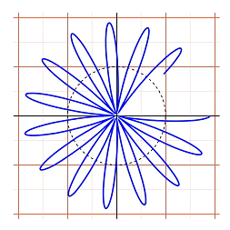

得到的函数即

$$
g(t)\mathrm{e}^{-j2\pi ft}=g(t)\mathrm{e}^{-j\omega t}.
$$

对一段时间 $\Delta t$ 上的输入量，得到的图形的几何中心为

$$
\frac{1}{\Delta t}\int\limits_{\Delta t}g(t)\mathrm{e}^{-j\omega t}\mathrm{d}t.
$$

给定一个 $\omega$ 这个表达式会有确定的输出。当这个 $\omega$ 接近输入信号中一正弦分量的角频率时，会出现峰值，在其它时候则接近0。这样就达到了分离各个分量的目的。

更精确地，如果在整个数轴上积分，则 $\omega$ 不等于任一分量角频率时，图形将是完全对称的，即输出为零，以上函数只在分量角频率出取非零值。积分前的系数也一并除去，使得持续时间长的分量在输出上有更大的值，由此得到

$$
F(\omega)=\int\nolimits_{-\infty}^{+\infty}g(t)\mathrm{e}^{-j\omega t}\mathrm{d}t,
$$

即傅里叶变换。

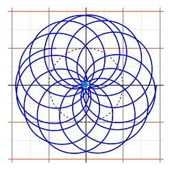
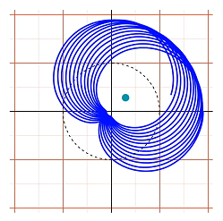
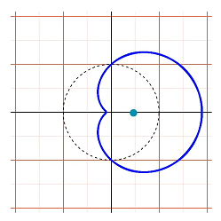

## 内接正方形问题

问题：平面上任意闭合回路上是否可以找到四个点组成一个正方形？（尚未解决）

弱化问题：平面上任意闭合回路上是否可以找到四个点组成一个矩形？

寻找一个内接矩形相当于找到两个互异的点对，它们的距离相等并且中点重合。如果在回路中取出任一点对，在其中点正上方，作一距离到平面为点对距离的点。这样的点集是一个以回路为边界的连续曲面。要证存在上述的两个点对，相当于证明这两个互异的点对被映射到了同一个点，即该曲面自交。

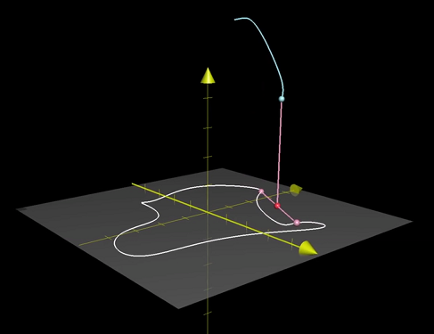

将曲面上的点映射到 $[0,1]$ 上，那么点对就可以被映射到正方形$[0,1]\times[0,1]$上。又由于这个正方形的两组对边的对应点分别由一组点对映射而来，所以在逆映射时应将正方形两对边分别连接到一起。但这样表示的点对是有序的。这样的情况下同一点对会被视为两对。

为了表示无序点对，我们只需取正方形 $x\leqslant y$ 的部分。得到的三角形中，$x=y$ 上的点是点对两点重合的情况，即映射得到的点就落在回路上。

但是为了逆映射的完整性，还需要将下边界和右边界按箭头方向连接到一起，即 $(x,0)$ 和 $(1,x)$ 表示的其实是同一点对。要这样做我们将这个三角形先切开，连接两边再将切开的边连接回去。这样得到的是一个莫比乌斯带。这样就建立了点对和莫比乌斯带上的点的连续一对一关系。

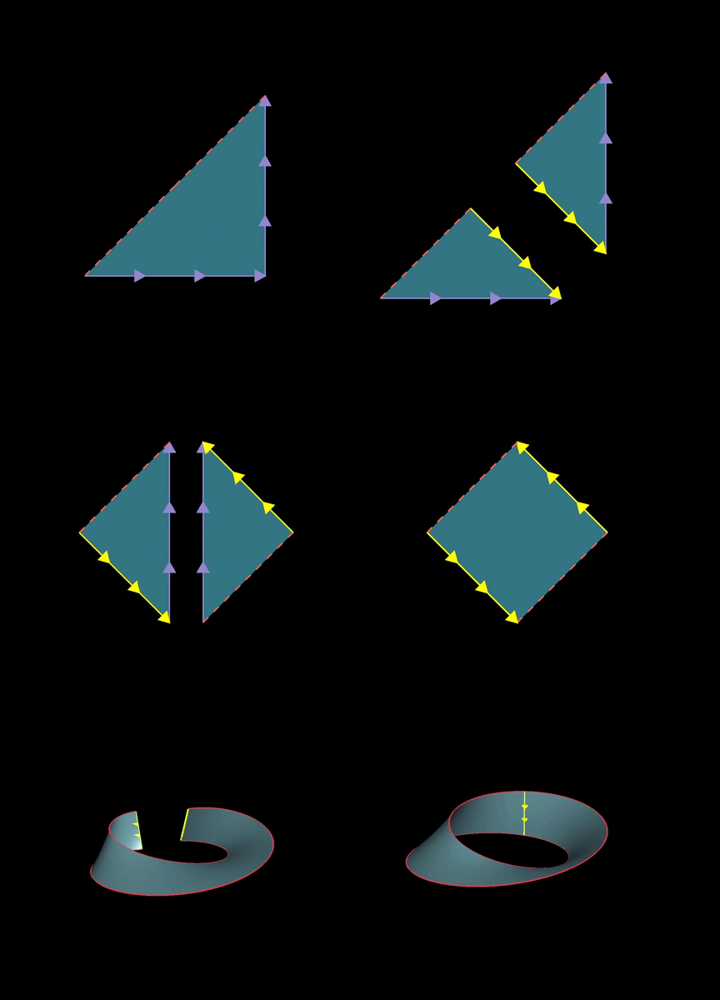

由于点对和曲面上的点又有连续一对一关系，所以可以将这个莫比乌斯到连续地映射到曲面上。即这个莫比乌斯带和曲面同胚。这样来看，由于莫比乌斯带边界上是点对两点重合的情况，那么它必定映射到回路上，而这样做的结果就是曲面自交。得证。

## 分圆问题

问题：在圆上取 $n$ 个点，用线段两两连接它们，点的取法使得不出现三线交于一点的情况。这些线段将圆分为多少区域？

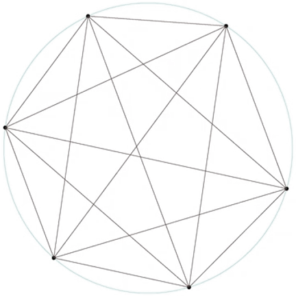

由于每一对点对都有线段连接，所以任意四个点连接而成的线段都对应在圆内的一个交点。故圆内交点数为 $\mathrm{C}_n^4$，即这些线段的交点总数为

$$
V=\mathrm{C}_n^4+n.
$$

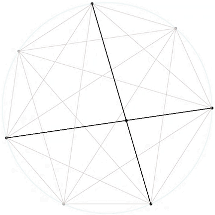

显然连接圆上分点的线段数为 $\mathrm{C}_n^2$. 圆内交点在分割这些线段时，由于不存在三线共点，故每增加一个交点，会使得边数增加2. 再计入圆弧，总边数

$$
E=\mathrm{C}_n^2+2\cdot\mathrm{C}_n^4+n.
$$

由欧拉公式

$$
V-E+F=2
$$

整个平面中区域数为

$$
F=\mathrm{C}_n^2+\mathrm{C}_n^4+2.
$$

则圆内区域数

$$
F_\mathrm{in}=F-1=\mathrm{C}_n^2+\mathrm{C}_n^4+1.
$$

## 滑块碰撞与$\pi$

两个滑块静止在一边是无限重墙壁的光滑平面上，大滑块首先朝内运动，使得小滑块在墙壁和大滑块之间来回碰撞，且这个系统在整个运动过程中没有能量损失。若大滑块质量是小滑块的 $100^n\;(n\in\mathbb{N}^+)$ 倍，则总碰撞次数正好是 $\pi$ 的前几位数字。

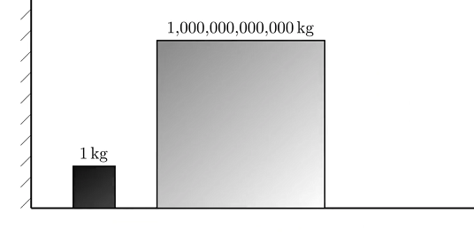

整个运动过程始终满足能量守恒

$$
\frac{1}{2}m_1v_1^2+\frac{1}{2}m_2v_2^2=\text{const}.
$$

绘制 $x=\sqrt{m_1}\cdot v_1$ 和 $y=\sqrt{m_2}\cdot v_2$ 的关系得到一个圆，即两个滑块的速度相图。以向外为正，大滑块开始运动时，状态点位于圆的最左边。

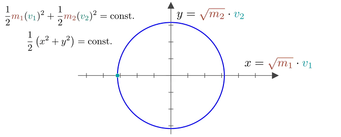

发生第一次碰撞时，发生动量的传递，由动量定理

$$
m_1v_1+m_2v_2=\text{const},
$$

第一次碰撞前后的状态必在斜率为 $k=-\sqrt{\cfrac{m_1}{m_2}}$ 的直线上。

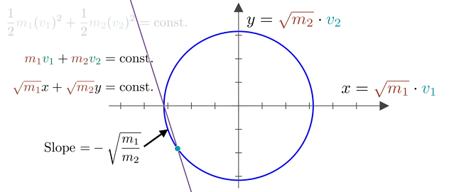

接下来，小滑块撞向墙壁，使得速度反向。即状态点跳变至关于 $x$ 轴对称的点。

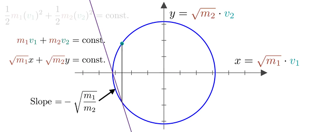

接下来的运动过程仍满足上述规律，直到最后一次碰撞结束，即 $0\leqslant v_1<v_2$，对应于状态点落在紫色区域时。

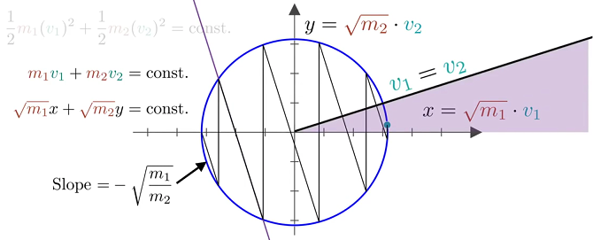

观察相图可得，由于其中表示动量守恒的直线斜率不变，故这组折线将圆周（除了最右边一段）分为对应圆周角相等的圆弧，即这些圆弧对应相等的圆周角，记为 $2\theta$.

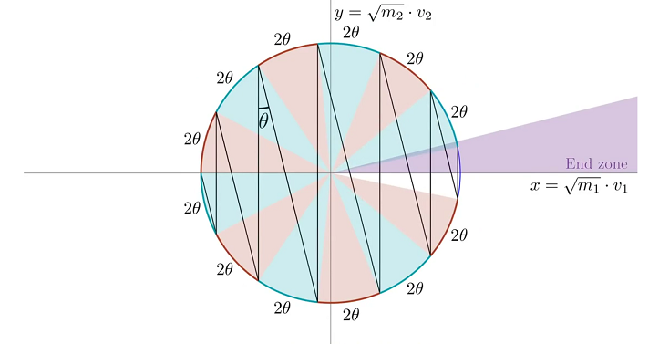

所以碰撞次数为满足 $N\cdot 2\theta<2\pi$ 的 $N$ 的最大整数值。而圆周角

$$
\theta=\arctan\vert k\vert,
$$

若大小滑块的质量比满足

$$
m_2:m_1=100^n,
$$

由于 $\theta$ 较小，

$$
\theta=\arctan\sqrt{\cfrac{m_1}{m_2}}\approx10^{-n}.
$$

故可以求出

$$
N=\left\lfloor \frac{\pi}{10^n}\right\rfloor,
$$

即 $\pi$ 的前几位。

## 微积分的本质

### 正弦函数的导数

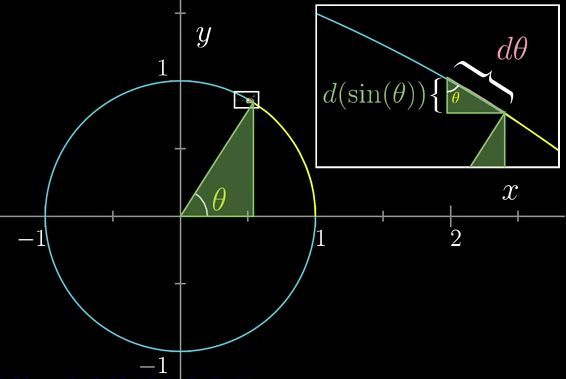

作单位圆和对应的正弦线，取小量 $\mathrm{d}\theta$ 对应正弦函数的变化量 $\mathrm{d}(\sin\theta)$，由此组成的三角形和图中大三角形相似。由此，

$$
\frac{\mathrm{d}(\sin\theta)}{\mathrm{d}\theta}=\frac{邻边}{斜边}=\cos\theta.
$$

### $\tfrac{0}{0}$ 型不定式的洛必达法则

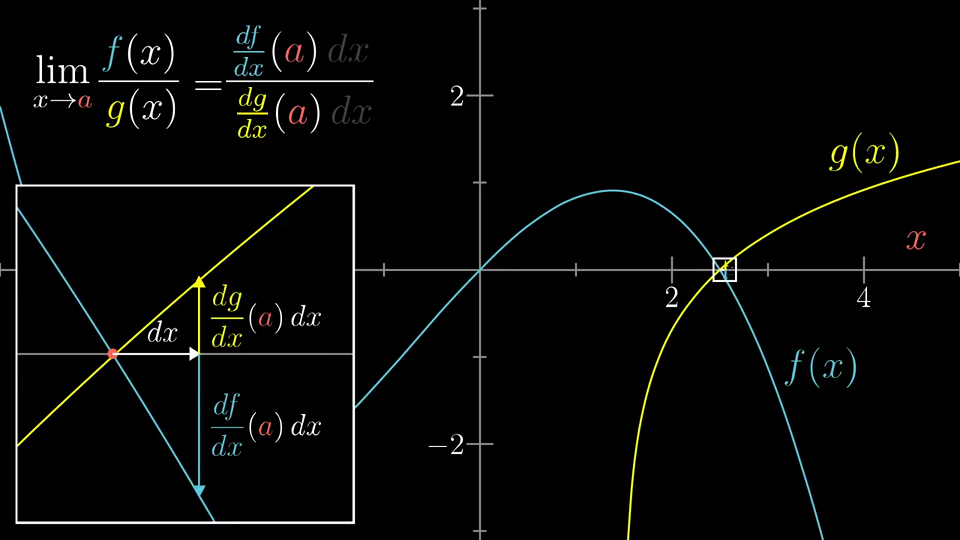

在零点 $x=a$ 附近取小量 $\mathrm{d}x$，两个函数在此都视为线性，则

$$
\frac{f(x)}{g(x)}\approx\frac{\cfrac{\mathrm{d}f}{\mathrm{d}x}(a)\cdot\mathrm{d}x}{\cfrac{\mathrm{d}g}{\mathrm{d}x}(a)\cdot\mathrm{d}x},
$$

即

$$
\lim\limits_{x\rightarrow a}\frac{f(x)}{g(x)}=\frac{\cfrac{\mathrm{d}f}{\mathrm{d}x}(a)}{\cfrac{\mathrm{d}g}{\mathrm{d}x}(a)}.
$$
