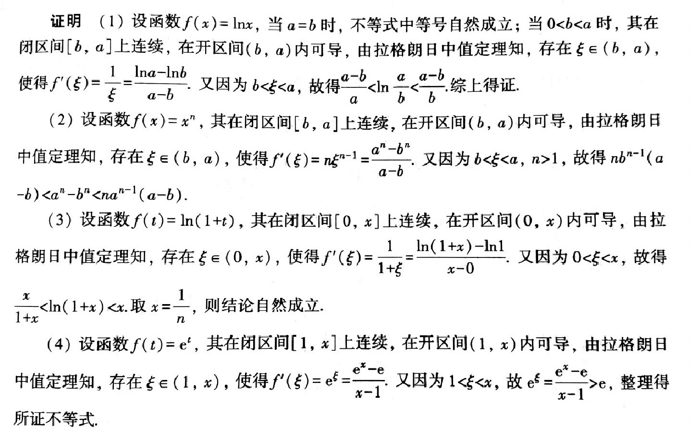

# Calculus

## 极限

*1*  
求极限

$$
\lim_{x\rightarrow 0}\frac{\sqrt[3]{1+x}-\sqrt[3]{1-x}}{x}.
$$

->  
  

*2*  
已知

$$
\lim_{x\rightarrow\infty}\left(\frac{x^2}{1+x}-ax-b\right)=0,
$$

求常数 $a$、$b$.

->  
  

*3*  
求 $x\rightarrow 0$ 时，$4x\tan^3x$ 和 $\tan x - \sin x$ 的无穷小阶数。

->  
  

*4*  
设 $f(x)=x(x-1)(x-2)\cdots(x-100)$，求 $f'(50).$

->
  

## 单变量微分

*1*    
求 $\lim\limits_{x\rightarrow0^+}\left(\cos\sqrt{x}\right)^{1/x}$

->

解：

$$
\begin{aligned}
\lim_{x\rightarrow0^+}\left(\cos\sqrt{x}\right)^{1/x} &=
\lim_{x\rightarrow0^+}\left(1+\cos\sqrt{x}-1\right)^{\frac{1}{\cos\sqrt{x}-1}\cdot\frac{\cos\sqrt{x}-1}{x}}\\
&= \mathrm{e}^{-1/2}
\end{aligned}
$$

*2*    
  
->  

